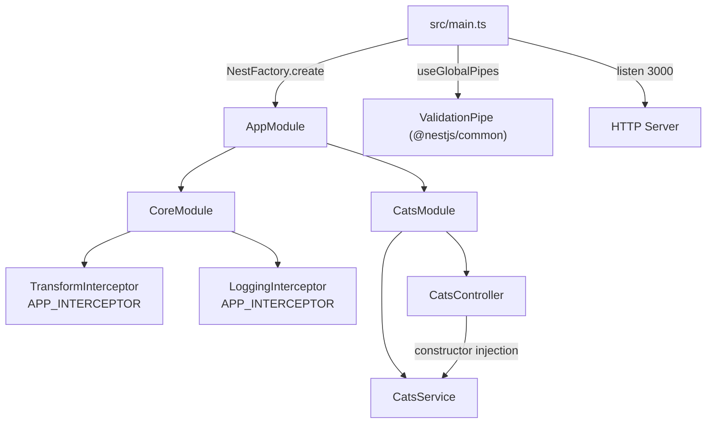
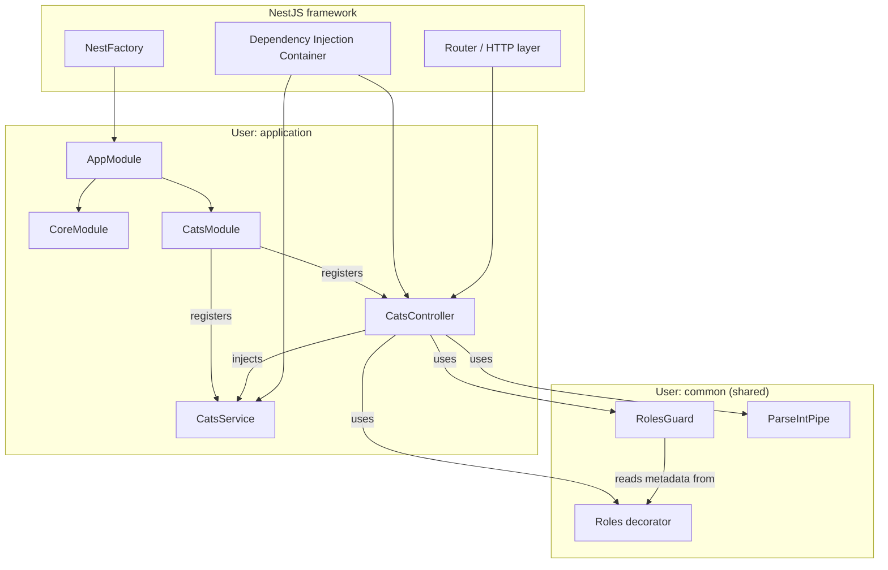
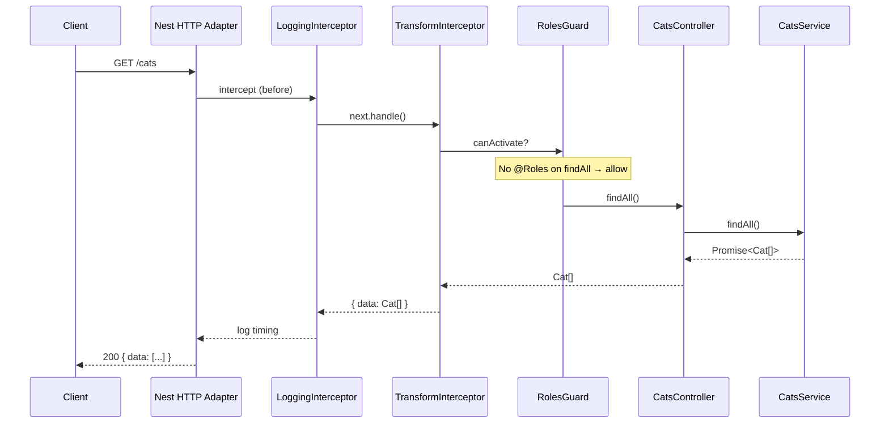
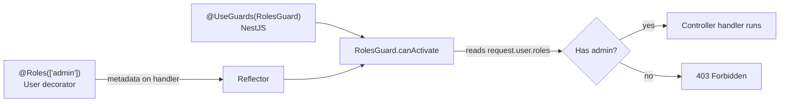

# 01-cats-app — NestJS Sample

A minimal NestJS application that demonstrates modules, controllers, services, dependency injection, and common cross-cutting concerns (guards, pipes, interceptors, filters, middleware). The **cats feature is fully wired**; several files under `src/common/` are **reference implementations** not registered in any module yet.

## Quick start

```bash
cd sample/01-cats-app
npm install
npm run start:dev
```

App listens on **http://localhost:3000**.

| Method | Path        | Description                                              |
| ------ | ----------- | -------------------------------------------------------- |
| `GET`  | `/cats`     | List all cats (wrapped by `TransformInterceptor`)        |
| `POST` | `/cats`     | Create a cat (requires `admin` role via `RolesGuard`)    |
| `GET`  | `/cats/:id` | Stub route; parses `:id` with custom `ParseIntPipe`      |

---


<!-- CORE_INVENTORY_START -->
## Core elements inventory

> Generated from `01-cats-app/src`. **Wired** = registered in a module or applied globally. **Example** = present in code but not registered.

### Application type

| Property | Value |
| -------- | ----- |
| **Bootstrap** | `NestFactory.create(AppModule)` |
| **Kind** | HTTP server |
| **Entry file** | `main.ts` |
| **Port** | 3000 |

**Global setup (`main.ts`):** `ValidationPipe` (global, `@nestjs/common`)

### Modules (3)

| Module | Path | Imports | Controllers | Providers |
| ------ | ---- | ------- | ----------- | --------- |
| `AppModule` | `src/app.module.ts` | `CoreModule`, `CatsModule` | — | — |
| `CatsModule` | `src/cats/cats.module.ts` | — | `CatsController` | `CatsService` |
| `CoreModule` | `src/core/core.module.ts` | — | — | `TransformInterceptor`, `LoggingInterceptor` |

### Controllers (1)

| Name | Path | Status |
| ---- | ---- | ------ |
| `CatsController` | `src/cats/cats.controller.ts` | **Wired** |

### Providers / services (1)

| Name | Path | Status |
| ---- | ---- | ------ |
| `CatsService` | `src/cats/cats.service.ts` | **Wired** |

### Guards (1)

| Name | Path | Status |
| ---- | ---- | ------ |
| `RolesGuard` | `src/common/guards/roles.guard.ts` | **Wired** |

### Interceptors (4)

| Name | Path | Status |
| ---- | ---- | ------ |
| `ErrorsInterceptor` | `src/common/interceptors/exception.interceptor.ts` | Example (not registered) |
| `LoggingInterceptor` | `src/core/interceptors/logging.interceptor.ts` | **Wired** |
| `TimeoutInterceptor` | `src/common/interceptors/timeout.interceptor.ts` | Example (not registered) |
| `TransformInterceptor` | `src/core/interceptors/transform.interceptor.ts` | **Wired** |

### Pipes (2)

| Name | Path | Status |
| ---- | ---- | ------ |
| `ParseIntPipe` | `src/common/pipes/parse-int.pipe.ts` | **Wired** |
| `ValidationPipe` | `src/common/pipes/validation.pipe.ts` | Example (not registered) |

### Exception filters (1)

| Name | Path | Status |
| ---- | ---- | ------ |
| `HttpExceptionFilter` | `src/common/filters/http-exception.filter.ts` | Example (not registered) |

### Middleware (1)

| Name | Path | Status |
| ---- | ---- | ------ |
| `LoggerMiddleware` | `src/common/middleware/logger.middleware.ts` | Example (not registered) |

### Decorators used (12)

| Library | Decorators |
| ------- | ---------- |
| **@nestjs (@nestjs/common)** | `@Body`, `@Catch`, `@Controller`, `@Get`, `@Injectable`, `@Module`, `@Param`, `@Post`, `@UseGuards` |
| **User-created** | `@Roles` |
| **class-validator** | `@IsInt`, `@IsString` |

---
<!-- CORE_INVENTORY_END -->
## Project structure

```
sample/01-cats-app/
├── src/
│   ├── main.ts                          # Bootstrap: create app, global pipes, listen
│   ├── app.module.ts                    # Root module
│   ├── cats/                            # Feature module (active)
│   │   ├── cats.module.ts
│   │   ├── cats.controller.ts
│   │   ├── cats.service.ts
│   │   ├── dto/create-cat.dto.ts
│   │   └── interfaces/cat.interface.ts
│   ├── core/                            # Global cross-cutting (active)
│   │   ├── core.module.ts
│   │   └── interceptors/
│   │       ├── logging.interceptor.ts
│   │       └── transform.interceptor.ts
│   └── common/                          # Reusable building blocks (mixed: some used, some examples)
│       ├── decorators/roles.decorator.ts
│       ├── guards/roles.guard.ts
│       ├── pipes/
│       │   ├── parse-int.pipe.ts        # Used in controller
│       │   └── validation.pipe.ts       # Example only (app uses Nest built-in)
│       ├── interceptors/
│       │   ├── timeout.interceptor.ts   # Example only
│       │   └── exception.interceptor.ts # Example only
│       ├── filters/http-exception.filter.ts  # Example only
│       └── middleware/logger.middleware.ts   # Example only
├── e2e/cats/cats.e2e-spec.ts
└── package.json
```

---

## How the app boots



1. `main.ts` creates the app from `AppModule`.
2. A **global** `ValidationPipe` from `@nestjs/common` validates DTOs on incoming requests.
3. `AppModule` imports `CoreModule` (global interceptors) and `CatsModule` (cats API).
4. Nest's DI container wires `CatsController` → `CatsService`.

---

## Module graph and ownership



| Component              | Path                                         | Origin     | Registered in module?              | Role                                      |
| ---------------------- | -------------------------------------------- | ---------- | ---------------------------------- | ----------------------------------------- |
| `AppModule`            | `src/app.module.ts`                          | **User**   | Root                               | Composes the app                          |
| `CoreModule`           | `src/core/core.module.ts`                    | **User**   | Imported by `AppModule`            | Registers global interceptors             |
| `CatsModule`           | `src/cats/cats.module.ts`                    | **User**   | Imported by `AppModule`            | Binds cats controller + service           |
| `CatsController`       | `src/cats/cats.controller.ts`                | **User**   | `CatsModule.controllers`           | HTTP routes under `/cats`                 |
| `CatsService`          | `src/cats/cats.service.ts`                   | **User**   | `CatsModule.providers`             | In-memory cat store                       |
| `CreateCatDto`         | `src/cats/dto/create-cat.dto.ts`             | **User**   | — (used as type)                   | Request body shape + validation           |
| `Cat`                  | `src/cats/interfaces/cat.interface.ts`       | **User**   | —                                  | Domain type                               |
| `RolesGuard`           | `src/common/guards/roles.guard.ts`           | **User**   | Used via `@UseGuards`              | Authorization                             |
| `Roles`                | `src/common/decorators/roles.decorator.ts`   | **User**   | —                                  | Metadata for required roles               |
| `ParseIntPipe`         | `src/common/pipes/parse-int.pipe.ts`         | **User**   | Instantiated inline                | Param validation                          |
| `TransformInterceptor` | `src/core/interceptors/transform.interceptor.ts` | **User** | `CoreModule` via `APP_INTERCEPTOR` | Wraps responses as `{ data: ... }`        |
| `LoggingInterceptor`   | `src/core/interceptors/logging.interceptor.ts`   | **User** | `CoreModule` via `APP_INTERCEPTOR` | Logs before/after handler                 |
| `ValidationPipe` (used)| `@nestjs/common`                             | **NestJS** | Global in `main.ts`                | DTO validation                            |
| `ValidationPipe` (custom)| `src/common/pipes/validation.pipe.ts`        | **User**   | **Not wired**                      | Example custom pipe                       |
| `HttpExceptionFilter`  | `src/common/filters/http-exception.filter.ts`| **User**   | **Not wired**                      | Example exception filter                  |
| `TimeoutInterceptor`   | `src/common/interceptors/timeout.interceptor.ts` | **User** | **Not wired**                  | Example interceptor                       |
| `ErrorsInterceptor`    | `src/common/interceptors/exception.interceptor.ts` | **User** | **Not wired**                | Example interceptor                       |
| `LoggerMiddleware`     | `src/common/middleware/logger.middleware.ts` | **User** | **Not wired**                      | Example middleware                        |

---

## Request lifecycle (GET /cats)



For `POST /cats`, the same pipeline runs, but `RolesGuard` reads `@Roles(['admin'])` metadata and checks `request.user.roles`.

---

## Controllers, services, and their relations

### CatsController ↔ CatsService

```typescript
// src/cats/cats.controller.ts
constructor(private readonly catsService: CatsService) {}
```

- **Relation:** Constructor injection. Nest sees `CatsService` in the constructor, looks it up in `CatsModule.providers`, and injects a singleton instance.
- **Controller** = HTTP layer (routing, status codes, request/response).
- **Service** = business/data layer (here, an in-memory array).

| Controller method | HTTP           | Calls service                 | Notes                                      |
| ----------------- | -------------- | ----------------------------- | ------------------------------------------ |
| `create()`        | `POST /cats`   | `catsService.create(dto)`     | Protected by `@Roles(['admin'])`           |
| `findAll()`       | `GET /cats`    | `catsService.findAll()`       | Returns `{ data: cats }` via interceptor   |
| `findOne()`       | `GET /cats/:id`| *(none)*                      | Stub; only logs parsed `id`                |

### CatsModule registration

```typescript
// src/cats/cats.module.ts
@Module({
  controllers: [CatsController],
  providers: [CatsService],
})
```

- `controllers` → Nest registers routes from `@Controller`, `@Get`, `@Post`, etc.
- `providers` → Nest registers injectable classes for DI.

### Classes, interfaces & types in this sample

Nest uses TypeScript **classes** for things that run and carry decorators; **interfaces** for shape-only descriptions that vanish after compile.

**Interface — shape of a cat (no runtime file):**

```typescript
// src/cats/interfaces/cat.interface.ts
export interface Cat {
  name: string;
  age: number;
  breed: string;
}
```

**Class — request body + validation (exists at runtime):**

```typescript
// src/cats/dto/create-cat.dto.ts
export class CreateCatDto {
  @IsString()
  readonly name: string;
  @IsInt()
  readonly age: number;
  @IsString()
  readonly breed: string;
}
```

**Class — service Nest injects (exists at runtime):**

```typescript
// src/cats/cats.service.ts
@Injectable()
export class CatsService {
  private readonly cats: Cat[] = [];
  findAll(): Promise<Cat[]> { ... }
}
```

| | **Class** | **Interface** | **Type alias** (`type X = …`) |
| --- | --- | --- | --- |
| **Exists at runtime?** | Yes (object in memory) | No (TypeScript only) | No |
| **Can use `@Injectable()`, `@IsString()`, etc.?** | Yes | No | No |
| **Typical use in Nest** | Controllers, services, DTOs, guards | Domain/response shapes | Unions, aliases (`type Role = 'admin' \| 'user'`) |
| **This sample** | `CatsService`, `CreateCatDto` | `Cat` | *(not used here)* |

**Why `CreateCatDto` is a class:** `ValidationPipe` needs real decorators on a class to validate POST bodies.

**Why `Cat` is an interface:** it only types the in-memory array — no decorators or Nest registration needed.

**Why it matters:** wrong field names fail at compile time; DTO vs domain types keep “what clients send” separate from “what we store/return”. See the glossary: [Classes, interfaces & types](../glossary.html#typescript-class-interface-type).

### CoreModule (global interceptors)

```typescript
// src/core/core.module.ts
@Module({
  providers: [
    { provide: APP_INTERCEPTOR, useClass: TransformInterceptor },
    { provide: APP_INTERCEPTOR, useClass: LoggingInterceptor },
  ],
})
```

- `APP_INTERCEPTOR` is a Nest **token** from `@nestjs/core`.
- Interceptors registered this way run for **every** route in the app.

---

## Decorator glossary (`@`)

Decorators attach metadata or behavior to classes, methods, or parameters. Nest reads that metadata at startup and request time.

### Legend

| Tag               | Meaning                                      |
| ----------------- | -------------------------------------------- |
| **NestJS**        | From `@nestjs/common` or `@nestjs/core`      |
| **User**          | Defined in this sample                       |
| **class-validator** | From `class-validator` package             |

---

### Class-level decorators

| Decorator                  | Library  | Used on                              | Purpose in this sample                                      |
| -------------------------- | -------- | ------------------------------------ | ----------------------------------------------------------- |
| `@Module({...})`           | **NestJS** | `AppModule`, `CatsModule`, `CoreModule` | Declares a module: imports, controllers, providers, exports |
| `@Controller('cats')`      | **NestJS** | `CatsController`                     | Marks class as controller; base path `/cats`                |
| `@Injectable()`            | **NestJS** | `CatsService`, guards, pipes, interceptors, middleware | Marks class as injectable provider          |
| `@UseGuards(RolesGuard)`   | **NestJS** | `CatsController`                     | Applies `RolesGuard` to all routes in this controller       |
| `@Catch(HttpException)`    | **NestJS** | `HttpExceptionFilter`                | Binds filter to `HttpException` (file not wired)            |

---

### Method-level decorators

| Decorator            | Library  | Used on       | Purpose                              |
| -------------------- | -------- | ------------- | ------------------------------------ |
| `@Get()`             | **NestJS** | `findAll()`   | Maps to `GET /cats`                  |
| `@Get(':id')`        | **NestJS** | `findOne()`   | Maps to `GET /cats/:id`              |
| `@Post()`            | **NestJS** | `create()`    | Maps to `POST /cats`                 |
| `@Roles(['admin'])`  | **User**   | `create()`    | Sets metadata: only `admin` role allowed |

`Roles` is **not** a Nest built-in. It is created with `Reflector.createDecorator`:

```typescript
// src/common/decorators/roles.decorator.ts
import { Reflector } from '@nestjs/core';

export const Roles = Reflector.createDecorator<string[]>();
```

`RolesGuard` reads that metadata at runtime:

```typescript
// src/common/guards/roles.guard.ts (full canActivate)
canActivate(context: ExecutionContext): boolean {
  const roles = this.reflector.get(Roles, context.getHandler());
  if (!roles) {
    return true;
  }
  const request = context.switchToHttp().getRequest();
  const user = request.user;
  const hasRole = () =>
    user.roles.some(role => !!roles.find(item => item === role));

  return user && user.roles && hasRole();
}
```

#### Walkthrough: line by line

| Line | What it does | Plain English |
| ---- | ------------ | ------------- |
| `reflector.get(Roles, context.getHandler())` | Reads metadata attached by `@Roles(...)` on **this** route handler | “Did this method declare required roles?” Returns `['admin']` on `create()`, or `undefined` on `findAll()` / `findOne()` |
| `if (!roles) return true` | No `@Roles` on this route → guard **allows** the request | **Opt-in protection:** only routes you stamp with `@Roles` are checked. `GET /cats` has no `@Roles`, so the guard steps aside (`canActivate` = **true** = “yes, continue”). |
| `context.switchToHttp().getRequest()` | Gets the Express/Fastify request object | Same `req` you would use in middleware |
| `request.user` | Who is calling (expected to be set by auth) | **Not set in this sample.** In a real app, login/JWT middleware puts `{ roles: ['admin', …] }` here. See sample **19-auth-jwt**. |
| `user.roles.some(...)` | “Does the user have **at least one** of the required roles?” | Loops each role on the user and checks if any matches the route’s required list |
| `roles.find(item => item === role)` | Search required roles for a match to this user role | Returns `'admin'` if found, or `undefined` if not |
| `!!roles.find(...)` | Converts result to strict **boolean** | See **Why `!!`?** below |
| `return user && user.roles && hasRole()` | All must be truthy to allow | No user → deny. No `roles` array → deny. No matching role → deny. |

#### Why `return true` when `!roles`?

`canActivate` answers one question: **“May this request reach the controller handler?”**

- **`true`** → yes, continue (Nest runs the route).
- **`false`** → no, stop (Nest responds with **403 Forbidden** by default).

When `roles` is `undefined`, this route never got `@Roles(...)`. The guard treats that as **“no extra role rule here”** and returns **`true`**. That is intentional: `@UseGuards(RolesGuard)` is on the whole controller, but only `POST /cats` adds `@Roles(['admin'])`. Listing cats stays open from the guard’s point of view.

If you wanted **every** route to require a role, you would either put `@Roles(...)` on each handler or change the guard to `if (!roles) return false`.

#### Why `!!roles.find(...)`?

`Array.find()` does **not** return `true`/`false`. It returns:

- the **matching item** (e.g. `'admin'`) if found, or
- **`undefined`** if nothing matched.

In JavaScript, both `'admin'` and `'editor'` are **truthy**; `undefined` is **falsy**. So you *could* write:

```typescript
roles.find(item => item === role) // truthy = match, falsy = no match
```

The **`!!`** (double negation) forces a real boolean:

```typescript
!!roles.find(item => item === role) // true or false, always
```

- First `!` turns truthy → `false`, falsy → `true`.
- Second `!` flips again → **`true`** if a match existed, **`false`** if not.

It is a common style when you want an explicit boolean inside `.some()` or `if` conditions.

#### Where are roles defined?

Two different “roles” lists:

1. **Required roles (route)** — you write them on the decorator: `@Roles(['admin'])`. Strings you choose; not loaded from a DB in this sample.
2. **User’s roles (caller)** — expected on `request.user.roles` (e.g. `['admin', 'user']`). This sample does not populate `request.user`; the guard shows the **pattern** only.

The decorator file (`roles.decorator.ts`) is the **blueprint** for `@Roles` — it does not contain `'admin'`. The mold is defined once; each `@Roles([...])` on a method presses different values into metadata.

---

### Parameter decorators

| Decorator                              | Library              | Used on                        | Purpose                                              |
| -------------------------------------- | -------------------- | ------------------------------ | ---------------------------------------------------- |
| `@Body()`                              | **NestJS**           | `create(@Body() createCatDto)` | Extracts and binds JSON body to `CreateCatDto`       |
| `@Param('id', new ParseIntPipe())`     | **NestJS** + **User** pipe | `findOne(..., id)`         | Extracts `:id` route param; `ParseIntPipe` converts/validates it |

Note: `@Param('id', new ParseIntPipe())` combines a **NestJS** parameter decorator with a **user-created** pipe instance.

---

### Property decorators (DTO validation)

| Decorator     | Library           | Used on                          | Purpose           |
| ------------- | ----------------- | -------------------------------- | ----------------- |
| `@IsString()` | **class-validator** | `CreateCatDto.name`, `.breed`  | Validates string  |
| `@IsInt()`    | **class-validator** | `CreateCatDto.age`             | Validates integer |

These work with the global `ValidationPipe` in `main.ts`:

```typescript
// src/main.ts
const app = await NestFactory.create(AppModule);
app.useGlobalPipes(new ValidationPipe());
```

---

### Decorator / metadata flow (authorization example)



---

## Non-decorator Nest building blocks

These use `@Injectable()` but implement **interfaces** from NestJS:

| Type            | Interface (NestJS)  | User class                                              | Active?              |
| --------------- | ------------------- | ------------------------------------------------------- | -------------------- |
| **Guard**       | `CanActivate`       | `RolesGuard`                                            | Yes (on controller)  |
| **Pipe**        | `PipeTransform`     | `ParseIntPipe`, custom `ValidationPipe`                 | `ParseIntPipe` yes   |
| **Interceptor** | `NestInterceptor`   | `LoggingInterceptor`, `TransformInterceptor`, others    | Core ones yes        |
| **Filter**      | `ExceptionFilter`   | `HttpExceptionFilter`                                   | No                   |
| **Middleware**  | `NestMiddleware`    | `LoggerMiddleware`                                      | No                   |

### Execution order (simplified)

```
Incoming request
  → Middleware (if configured)
  → Guards (@UseGuards)
  → Interceptors (before)
  → Pipes (@Body, @Param pipes)
  → Controller handler
  → Service
  → Interceptors (after / map response)
  → Exception filters (on error)
  → Outgoing response
```

---

## Dependency injection map

```mermaid
flowchart LR
    subgraph CatsModule
        CC[CatsController]
        CS[CatsService]
    end

    subgraph InjectedIntoController
        CS2[CatsService]
        RG[RolesGuard]
    end

    CC --> CS2
    CC -.->|@UseGuards| RG
    RG --> REF[Reflector<br/>NestJS built-in]

    subgraph CoreModule
        LI[LoggingInterceptor]
        TI[TransformInterceptor]
    end

    APP[APP_INTERCEPTOR token] --> LI
    APP --> TI
```

| Class            | Injected dependencies | Provided by                    |
| ---------------- | --------------------- | ------------------------------ |
| `CatsController` | `CatsService`         | `CatsModule.providers`         |
| `RolesGuard`     | `Reflector`           | Nest core (global)             |
| `CatsService`    | *(none)*              | —                              |

**Tip:** For reliable DI, add `RolesGuard` to `CatsModule.providers` when it has constructor dependencies.

---

## Data types

| Type           | Path                                   | Role                                              |
| -------------- | -------------------------------------- | ------------------------------------------------- |
| `Cat`          | `src/cats/interfaces/cat.interface.ts` | Domain model (plain TypeScript interface)         |
| `CreateCatDto` | `src/cats/dto/create-cat.dto.ts`       | Input contract for `POST /cats`; validated at runtime |

`CreateCatDto` and `Cat` share the same fields; the DTO adds validation decorators.

---

## Tests

| File                              | What it verifies                                              |
| --------------------------------- | ------------------------------------------------------------- |
| `src/cats/cats.controller.spec.ts` | Unit: controller delegates to service                      |
| `e2e/cats/cats.e2e-spec.ts`       | E2E: `GET /cats` returns `{ data: [...] }` (interceptors included) |

---

## Mental model: how NestJS works here

1. **Modules** group related code and tell Nest what to register.
2. **Controllers** define HTTP routes; they stay thin and delegate to services.
3. **Services** hold logic/state; `@Injectable()` makes them injectable.
4. **Decorators** declare routes, validation, auth, and metadata — Nest reads them via reflection (`reflect-metadata`).
5. **Cross-cutting concerns** (guards, pipes, interceptors, filters, middleware) wrap the request pipeline without polluting business logic.

This sample is intentionally small: one feature module (`cats`), one infrastructure module (`core`), and a `common/` folder showing patterns you can wire in as needed.
