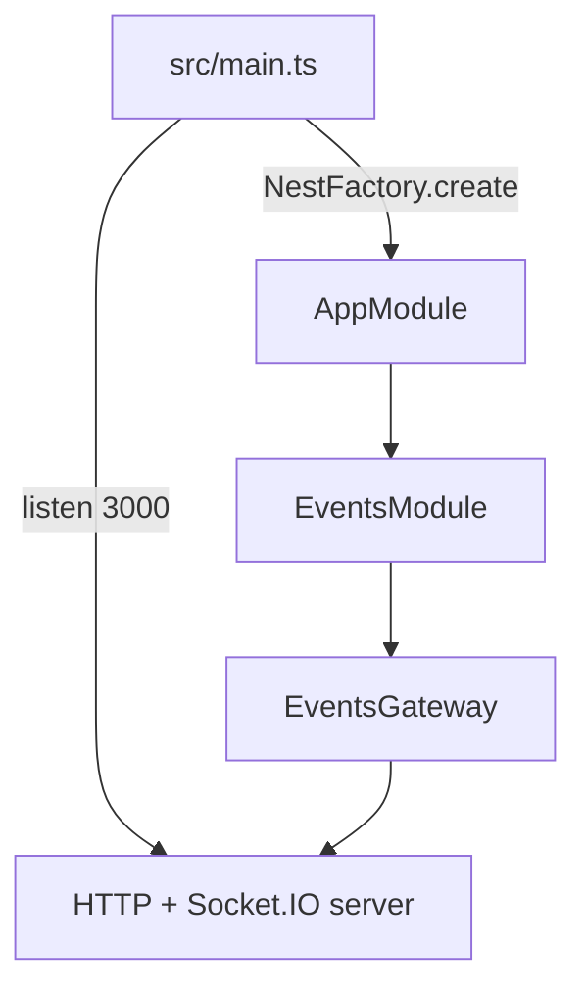

# 02-gateways — NestJS Sample

WebSocket gateway demo using **Socket.IO**. A single `EventsGateway` handles real-time messages over WebSockets while an HTTP server runs on the same Nest app. Optional **Redis adapter** code is included but not wired by default.

## Quick start

```bash
cd sample/02-gateways
npm install
npm run start:dev
```

HTTP listens on **http://localhost:3000**. WebSocket uses Socket.IO on the same port (default adapter behavior).

| Event (client → server) | Response |
| ----------------------- | -------- |
| `events`                | Streams `{ event: 'events', data: 1 }`, then `2`, then `3` |
| `identity`              | Echoes the sent number back |

Test manually with `client/index.html` (not served by Nest — open in a browser and point at the server).

---


<!-- CORE_INVENTORY_START -->
## Core elements inventory

> Generated from `02-gateways/src`. **Wired** = registered in a module or applied globally. **Example** = present in code but not registered.

### Application type

| Property | Value |
| -------- | ----- |
| **Bootstrap** | `NestFactory.create(AppModule)` |
| **Kind** | HTTP server |
| **Entry file** | `main.ts` |
| **Port** | 3000 |

### Modules (2)

| Module | Path | Imports | Controllers | Providers |
| ------ | ---- | ------- | ----------- | --------- |
| `AppModule` | `src/app.module.ts` | `EventsModule` | — | — |
| `EventsModule` | `src/events/events.module.ts` | — | — | `EventsGateway` |

### Controllers (0)

_None_

### Gateways (1)

| Name | Path | Status |
| ---- | ---- | ------ |
| `EventsGateway` | `src/events/events.gateway.ts` | **Wired** |

### Providers / services (0)

_None_

### Guards (0)

_None_

### Interceptors (0)

_None_

### Pipes (0)

_None_

### Exception filters (0)

_None_

### Middleware (0)

_None_

### Decorators used (6)

| Library | Decorators |
| ------- | ---------- |
| **@nestjs (@nestjs/common)** | `@Module` |
| **@nestjs (@nestjs/websockets)** | `@MessageBody`, `@SubscribeMessage`, `@WebSocketGateway`, `@WebSocketServer` |
| **Unknown** | `@socket` |

---
<!-- CORE_INVENTORY_END -->
## Project structure

```
sample/02-gateways/
├── src/
│   ├── main.ts
│   ├── app.module.ts
│   ├── adapters/
│   │   └── redis-io.adapter.ts       # Example only (commented in main.ts)
│   └── events/
│       ├── events.module.ts
│       └── events.gateway.ts
├── client/
│   └── index.html                    # Manual WebSocket test page
└── e2e/
```

---

## How the app boots



Redis adapter wiring in `main.ts` is **commented out**:

```typescript
// const redisIoAdapter = new RedisIoAdapter(app);
// await redisIoAdapter.connectToRedis();
// app.useWebSocketAdapter(redisIoAdapter);
```

---

## Module graph

| Component       | Path                              | Origin   | Registered in | Role                          |
| --------------- | --------------------------------- | -------- | ------------- | ----------------------------- |
| `AppModule`     | `src/app.module.ts`               | **User** | Root          | Imports `EventsModule`        |
| `EventsModule`  | `src/events/events.module.ts`     | **User** | `AppModule`   | Registers gateway as provider |
| `EventsGateway` | `src/events/events.gateway.ts`    | **User** | `EventsModule.providers` | WebSocket message handlers |
| `RedisIoAdapter`| `src/adapters/redis-io.adapter.ts`| **User** | **Not wired** | Horizontal scaling example    |

```mermaid
graph LR
    AppModule --> EventsModule
    EventsModule --> EventsGateway
    EventsGateway -->|@SubscribeMessage| Handlers[findAll / identity]
```

---

## Gateway methods and relations

`EventsGateway` has **no constructor dependencies** — it is registered as a provider and instantiated by Nest.

| Method / handler | Decorator trigger     | Input        | Output                                      |
| ---------------- | --------------------- | ------------ | ------------------------------------------- |
| `findAll()`      | `@SubscribeMessage('events')` | `@MessageBody()` any | RxJS stream of `WsResponse<number>` (1, 2, 3) |
| `identity()`     | `@SubscribeMessage('identity')` | `@MessageBody()` number | Same number (echo)                    |

`@WebSocketServer()` injects the Socket.IO `Server` instance on property `server` (available for broadcasting, not used in handlers).

---

## Decorator glossary (`@`)

| Decorator              | Library  | Level     | Used on              | Purpose                                      |
| ---------------------- | -------- | --------- | -------------------- | -------------------------------------------- |
| `@Module`              | **NestJS** | Class   | Modules              | Declares Nest module                         |
| `@WebSocketGateway({ cors })` | **NestJS** | Class | `EventsGateway` | Marks WebSocket gateway; CORS `origin: '*'` |
| `@WebSocketServer()`   | **NestJS** | Property | `server`        | Injects Socket.IO server                     |
| `@SubscribeMessage('events')` | **NestJS** | Method | `findAll`   | Binds handler to client event name           |
| `@SubscribeMessage('identity')` | **NestJS** | Method | `identity` | Binds handler to client event name           |
| `@MessageBody()`       | **NestJS** | Parameter | Handler args    | Extracts message payload from client         |

**User-created decorators:** none.

---

## Mental model

1. **Gateways** are the WebSocket equivalent of controllers — they handle messages instead of HTTP routes.
2. **`@SubscribeMessage`** maps a client event name to a handler method.
3. **`@WebSocketGateway`** configures the gateway (here: CORS for browser clients).
4. **Redis adapter** (example) would let multiple Nest instances share Socket.IO rooms across processes.

---

## Dependencies

`@nestjs/websockets`, `@nestjs/platform-socket.io`, `socket.io`, `@socket.io/redis-adapter`, `redis`
