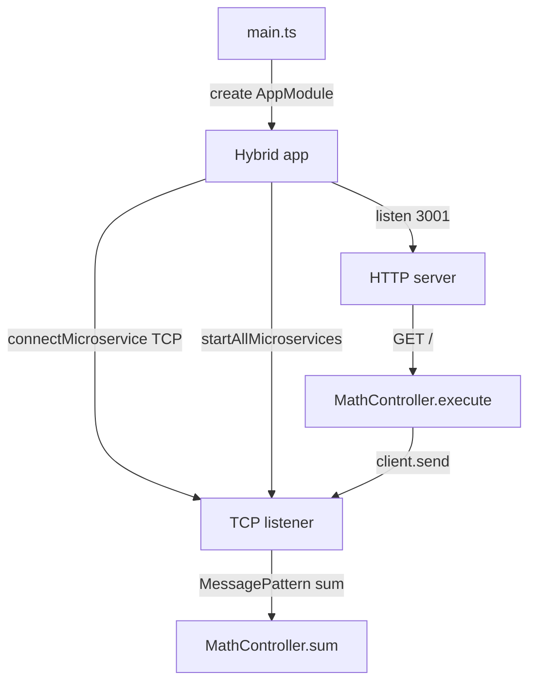
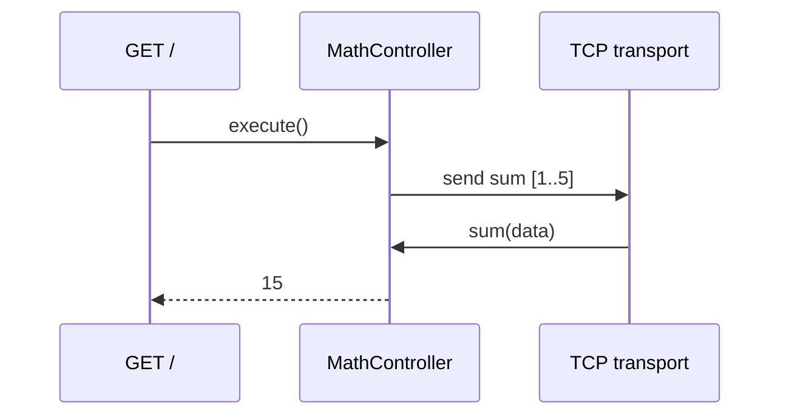

# 03-microservices — NestJS Sample

**Hybrid application**: one process runs both an HTTP server and a TCP microservice transport. An HTTP `GET /` triggers an RPC call that is handled by the same controller via `@MessagePattern` — demonstrating client and server in one app.

## Quick start

```bash
cd sample/03-microservices
npm install
npm run start:dev
```

HTTP listens on **http://localhost:3001** (not 3000).

| Method | Path | Description |
| ------ | ---- | ----------- |
| `GET`  | `/`  | Sends `{ cmd: 'sum' }` with `[1,2,3,4,5]` over TCP; returns `15` |

---


<!-- CORE_INVENTORY_START -->
## Core elements inventory

> Generated from `03-microservices/src`. **Wired** = registered in a module or applied globally. **Example** = present in code but not registered.

### Application type

| Property | Value |
| -------- | ----- |
| **Bootstrap** | `NestFactory.create(AppModule)` |
| **Kind** | Hybrid HTTP + microservice |
| **Entry file** | `main.ts` |
| **Port** | 3001 |

### Modules (2)

| Module | Path | Imports | Controllers | Providers |
| ------ | ---- | ------- | ----------- | --------- |
| `AppModule` | `src/app.module.ts` | `MathModule` | — | — |
| `MathModule` | `src/math/math.module.ts` | `ClientsModule` | `MathController` | — |

### Controllers (1)

| Name | Path | Status |
| ---- | ---- | ------ |
| `MathController` | `src/math/math.controller.ts` | **Wired** |

### Providers / services (0)

_None_

### Guards (0)

_None_

### Interceptors (1)

| Name | Path | Status |
| ---- | ---- | ------ |
| `LoggingInterceptor` | `src/common/interceptors/logging.interceptor.ts` | Example (not registered) |

### Pipes (0)

_None_

### Exception filters (1)

| Name | Path | Status |
| ---- | ---- | ------ |
| `ExceptionFilter` | `src/common/filters/rpc-exception.filter.ts` | Example (not registered) |

### Middleware (0)

_None_

### Decorators used (7)

| Library | Decorators |
| ------- | ---------- |
| **@nestjs (@nestjs/common)** | `@Catch`, `@Controller`, `@Get`, `@Inject`, `@Injectable`, `@Module` |
| **@nestjs (@nestjs/microservices)** | `@MessagePattern` |

---
<!-- CORE_INVENTORY_END -->
## Project structure

```
sample/03-microservices/
├── src/
│   ├── main.ts
│   ├── app.module.ts
│   ├── math/
│   │   ├── math.module.ts
│   │   ├── math.controller.ts
│   │   └── math.constants.ts
│   └── common/                       # Example only — not registered
│       ├── interceptors/logging.interceptor.ts
│       ├── filters/rpc-exception.filter.ts
│       └── strategies/nats.strategy.ts
```

---

## How the app boots



---

## Module graph

| Component        | Path                         | Origin   | Registered in              | Role                    |
| ---------------- | ---------------------------- | -------- | -------------------------- | ----------------------- |
| `AppModule`      | `src/app.module.ts`          | **User** | Root                       | Imports `MathModule`    |
| `MathModule`     | `src/math/math.module.ts`    | **User** | `AppModule`                | TCP client + controller |
| `MathController` | `src/math/math.controller.ts`| **User** | `MathModule.controllers`   | HTTP client + TCP handler |

`MathModule` registers a TCP client:

```typescript
ClientsModule.register([{ name: MATH_SERVICE, transport: Transport.TCP }])
```

---

## Controller methods and relations

`MathController` injects `ClientProxy` via custom token `MATH_SERVICE`:

```typescript
constructor(@Inject(MATH_SERVICE) private readonly client: ClientProxy) {}
```

| Method      | Trigger              | Role                                      |
| ----------- | -------------------- | ----------------------------------------- |
| `execute()` | HTTP `@Get()`        | Client: `client.send({ cmd: 'sum' }, data)` |
| `sum()`     | `@MessagePattern({ cmd: 'sum' })` | Server: sums array of numbers |



---

## Decorator glossary (`@`)

| Decorator                    | Library  | Used on           | Purpose                              |
| ---------------------------- | -------- | ----------------- | ------------------------------------ |
| `@Module`                    | **NestJS** | Modules         | Module declaration                   |
| `@Controller`                | **NestJS** | `MathController`| Marks controller (empty path)        |
| `@Get`                       | **NestJS** | `execute`       | HTTP GET `/`                         |
| `@Inject(MATH_SERVICE)`      | **NestJS** | Constructor     | Injects registered `ClientProxy`     |
| `@MessagePattern({ cmd: 'sum' })` | **NestJS** | `sum`      | TCP/RPC handler for pattern          |
| `@Injectable`                | **NestJS** | `LoggingInterceptor` | Example interceptor (not wired) |
| `@Catch`                     | **NestJS** | `ExceptionFilter` | Example filter (not wired)       |

**User-created decorators:** none.

---

## Wired vs example-only

| Wired | Example-only |
| ----- | ------------ |
| Hybrid TCP + HTTP on `:3001` | `LoggingInterceptor`, RPC `ExceptionFilter`, `NatsStrategy` |
| `ClientsModule` + dual-role `MathController` | Commented pure-microservice bootstrap in `main.ts` |

---

## Mental model

1. **Microservices** use message **patterns** (e.g. `{ cmd: 'sum' }`) instead of HTTP paths.
2. **`ClientProxy.send()`** returns an Observable for request/response RPC.
3. **`@MessagePattern`** marks the handler that receives those messages.
4. A **hybrid app** can expose HTTP for external callers while processing RPC internally.

---

## Dependencies

`@nestjs/microservices`, `@nestjs/platform-express`
