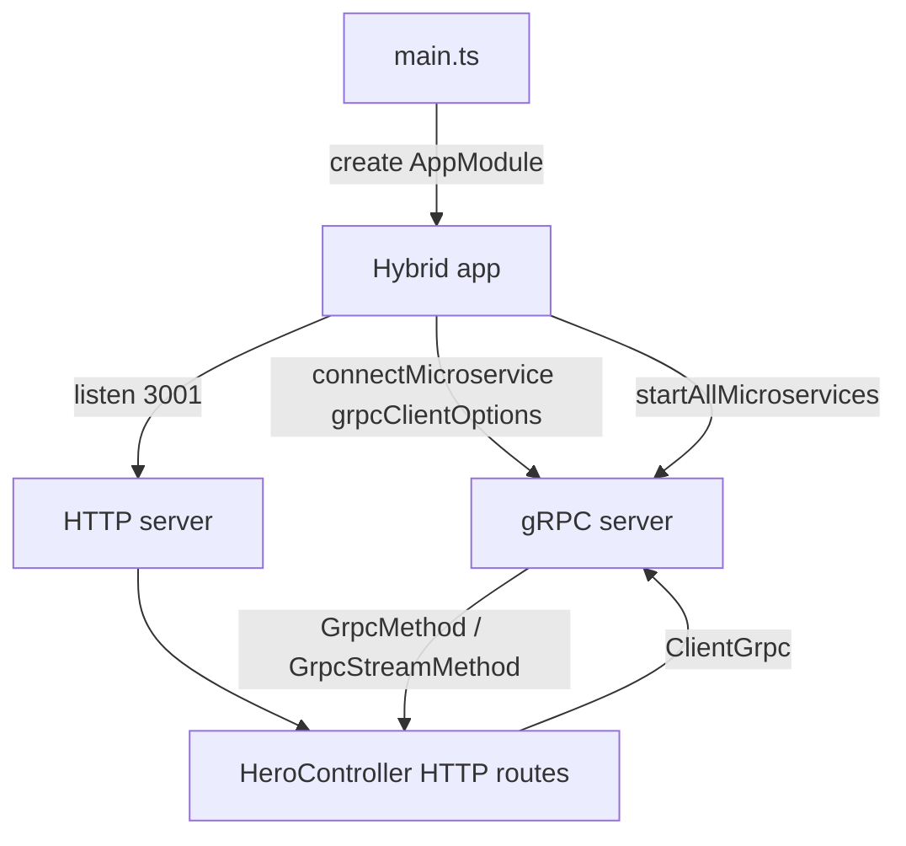

# 04-grpc — NestJS Sample

**Hybrid HTTP + gRPC** microservice. One controller acts as both gRPC **client** (HTTP routes proxy to gRPC) and gRPC **server** (`@GrpcMethod` / `@GrpcStreamMethod`). gRPC reflection is enabled for tooling.

## Quick start

```bash
cd sample/04-grpc
npm install
npm run start:dev
```

HTTP listens on **http://localhost:3001**.

| Method | Path              | Description                    |
| ------ | ----------------- | ------------------------------ |
| `GET`  | `/hero/:id`       | Find one hero by id via gRPC   |
| `GET`  | `/hero`           | List heroes via gRPC           |
| `GET`  | `/hero-stream/:id`| Stream hero by id via gRPC     |

---


<!-- CORE_INVENTORY_START -->
## Core elements inventory

> Generated from `04-grpc/src`. **Wired** = registered in a module or applied globally. **Example** = present in code but not registered.

### Application type

| Property | Value |
| -------- | ----- |
| **Bootstrap** | `NestFactory.create(AppModule)` |
| **Kind** | Hybrid HTTP + microservice |
| **Entry file** | `main.ts` |
| **Port** | 3001 |

### Modules (2)

| Module | Path | Imports | Controllers | Providers |
| ------ | ---- | ------- | ----------- | --------- |
| `AppModule` | `src/app.module.ts` | `HeroModule` | — | — |
| `HeroModule` | `src/hero/hero.module.ts` | `ClientsModule` | `HeroController` | — |

### Controllers (1)

| Name | Path | Status |
| ---- | ---- | ------ |
| `HeroController` | `src/hero/hero.controller.ts` | **Wired** |

### Providers / services (0)

_None_

### Guards (0)

_None_

### Interceptors (0)

_None_

### Pipes (0)

_None_

### Exception filters (0)

_None_

### Middleware (0)

_None_

### Decorators used (8)

| Library | Decorators |
| ------- | ---------- |
| **@nestjs (@nestjs/common)** | `@Controller`, `@Get`, `@Inject`, `@Module`, `@Param` |
| **@nestjs (@nestjs/microservices)** | `@GrpcMethod`, `@GrpcStreamMethod` |
| **Unknown** | `@grpc` |

---
<!-- CORE_INVENTORY_END -->
## Project structure

```
sample/04-grpc/
├── src/
│   ├── main.ts
│   ├── app.module.ts
│   ├── grpc-client.options.ts        # Shared gRPC transport config
│   └── hero/
│       ├── hero.module.ts
│       ├── hero.controller.ts
│       ├── hero.proto                # Copied to dist via nest-cli.json
│       └── interfaces/
│           ├── hero.interface.ts
│           └── hero-by-id.interface.ts
└── nest-cli.json                     # Assets: **/*.proto
```

---

## How the app boots



---

## Module graph

| Component         | Path                          | Origin   | Role                                      |
| ----------------- | ----------------------------- | -------- | ----------------------------------------- |
| `AppModule`       | `src/app.module.ts`           | **User** | Imports `HeroModule`                      |
| `HeroModule`      | `src/hero/hero.module.ts`     | **User** | Registers gRPC client + `HeroController`  |
| `HeroController`  | `src/hero/hero.controller.ts` | **User** | HTTP + gRPC client + gRPC server handlers |
| `grpcClientOptions` | `src/grpc-client.options.ts`| **User** | Package, proto path, URL, reflection      |

In-memory heroes: `[{ id: 1, name: 'John' }, { id: 2, name: 'Doe' }]`.

---

## Controller methods and relations

`HeroController` implements `OnModuleInit`:

```typescript
onModuleInit() {
  this.heroesService = this.client.getService<HeroesService>('HeroesService');
}
```

| Method (HTTP)     | HTTP route           | gRPC client call        |
| ----------------- | -------------------- | ----------------------- |
| `getHero()`       | `GET /hero/:id`      | `findOne({ id })`       |
| `getHeroes()`     | `GET /hero`          | `findAll({})`           |
| `getHeroStream()` | `GET /hero-stream/:id` | `findOneStream({ id })` |

| Method (gRPC server) | Decorator              | Role                    |
| -------------------- | ---------------------- | ----------------------- |
| `findOne()`          | `@GrpcMethod('HeroesService')` | Returns hero by id |
| `findAll()`          | `@GrpcMethod('HeroesService')` | Returns all heroes |
| `findOneStream()`    | `@GrpcStreamMethod('HeroesService')` | Streams one hero |

```mermaid
flowchart LR
    HTTP[HTTP request] --> HC[HeroController]
    HC -->|ClientGrpc| GRPC[gRPC HeroesService]
    GRPC -->|@GrpcMethod| HC
    HC --> HTTP
```

---

## Decorator glossary (`@`)

| Decorator                         | Library  | Used on              | Purpose                         |
| --------------------------------- | -------- | -------------------- | ------------------------------- |
| `@Module`                         | **NestJS** | Modules            | Module declaration              |
| `@Controller`                     | **NestJS** | `HeroController`   | HTTP controller                 |
| `@Get`, `@Param`                  | **NestJS** | HTTP handlers      | Route mapping                   |
| `@Inject('HERO_PACKAGE')`         | **NestJS** | Constructor          | Injects `ClientGrpc`            |
| `@GrpcMethod('HeroesService')`    | **NestJS** | `findOne`, `findAll` | gRPC unary handlers           |
| `@GrpcStreamMethod('HeroesService')` | **NestJS** | `findOneStream` | gRPC streaming handler          |

**User-created decorators:** none.

---

## Dependencies

`@nestjs/microservices`, `@grpc/grpc-js`, `@grpc/reflection`

---

## Mental model

1. **`.proto`** defines the service contract; Nest maps it to `@GrpcMethod` handlers.
2. **`ClientGrpc.getService()`** gives a typed client after module init.
3. **Hybrid apps** let you expose REST while speaking gRPC internally or to other services.
4. **Reflection** helps tools discover services without separate schema files at runtime.
