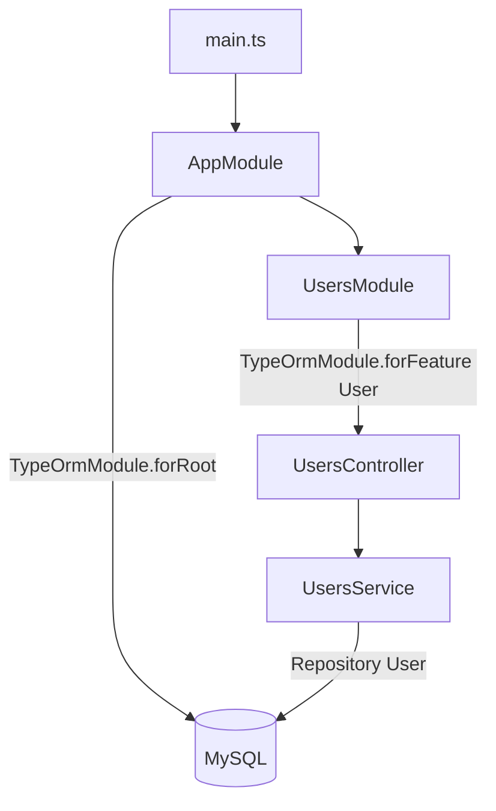

# 05-sql-typeorm — NestJS Sample

REST CRUD for **users** backed by **MySQL** via **TypeORM**. Demonstrates `@nestjs/typeorm` integration: root connection, feature module registration, entity decorators, and repository injection.

## Quick start

```bash
cd sample/05-sql-typeorm
npm install
```

### Database setup

This sample requires **MySQL**. Use Docker or a local installation.

**Docker:**

```bash
docker-compose up -d
docker-compose down   # when finished
```

Credentials in `src/app.module.ts` must match your database (`host`, `username`, `password`, `database`).

```bash
npm run start:dev
```

App listens on **http://localhost:3000**.

| Method   | Path           | Description   |
| -------- | -------------- | ------------- |
| `POST`   | `/users`       | Create user   |
| `GET`    | `/users`       | List users    |
| `GET`    | `/users/:id`   | Get one user  |
| `DELETE` | `/users/:id`   | Delete user   |

---


<!-- CORE_INVENTORY_START -->
## Core elements inventory

> Generated from `05-sql-typeorm/src`. **Wired** = registered in a module or applied globally. **Example** = present in code but not registered.

### Application type

| Property | Value |
| -------- | ----- |
| **Bootstrap** | `NestFactory.create(AppModule)` |
| **Kind** | HTTP server |
| **Entry file** | `main.ts` |
| **Port** | 3000 |

### Modules (2)

| Module | Path | Imports | Controllers | Providers |
| ------ | ---- | ------- | ----------- | --------- |
| `AppModule` | `src/app.module.ts` | `TypeOrmModule`, `UsersModule` | — | — |
| `UsersModule` | `src/users/users.module.ts` | `TypeOrmModule` | `UsersController` | `UsersService` |

### Controllers (1)

| Name | Path | Status |
| ---- | ---- | ------ |
| `UsersController` | `src/users/users.controller.ts` | **Wired** |

### Providers / services (1)

| Name | Path | Status |
| ---- | ---- | ------ |
| `UsersService` | `src/users/users.service.ts` | **Wired** |

### Guards (0)

_None_

### Interceptors (0)

_None_

### Pipes (0)

_None_

### Exception filters (0)

_None_

### Middleware (0)

_None_

### Decorators used (12)

| Library | Decorators |
| ------- | ---------- |
| **@nestjs (@nestjs/common)** | `@Body`, `@Controller`, `@Delete`, `@Get`, `@Injectable`, `@Module`, `@Param`, `@Post` |
| **@nestjs (@nestjs/typeorm)** | `@InjectRepository` |
| **NestJS** | `@Column`, `@Entity`, `@PrimaryGeneratedColumn` |

---
<!-- CORE_INVENTORY_END -->
## Project structure

```
sample/05-sql-typeorm/
├── src/
│   ├── main.ts
│   ├── app.module.ts                 # TypeOrmModule.forRoot(...)
│   └── users/
│       ├── users.module.ts
│       ├── users.controller.ts
│       ├── users.service.ts
│       ├── user.entity.ts
│       └── dto/create-user.dto.ts
└── docker-compose.yml
```

---

## How the app boots



---

## Module graph

| Component          | Path                            | Origin        | Registered in              | Role              |
| ------------------ | ------------------------------- | ------------- | -------------------------- | ----------------- |
| `AppModule`        | `src/app.module.ts`             | **User**      | Root                       | DB connection     |
| `UsersModule`      | `src/users/users.module.ts`     | **User**      | `AppModule.imports`        | Feature module    |
| `UsersController`  | `src/users/users.controller.ts` | **User**      | `UsersModule.controllers`  | HTTP CRUD         |
| `UsersService`     | `src/users/users.service.ts`    | **User**      | `UsersModule.providers`    | Business logic    |
| `User`             | `src/users/user.entity.ts`      | **User** + **TypeORM** | `forFeature` entity | DB table mapping |

---

## Controller ↔ Service ↔ Repository

```mermaid
flowchart LR
    UC[UsersController] -->|constructor| US[UsersService]
    US -->|@InjectRepository User| REPO[Repository User]
    REPO --> DB[(MySQL)]
```

| Controller method | HTTP            | Service method   |
| ----------------- | --------------- | ---------------- |
| `create()`        | `POST /users`   | `create(dto)`    |
| `findAll()`       | `GET /users`    | `findAll()`      |
| `findOne()`       | `GET /users/:id`| `findOne(id)`    |
| `remove()`        | `DELETE /users/:id` | `remove(id)` |

---

## Decorator glossary (`@`)

### NestJS

| Decorator              | Used on              | Purpose                          |
| ---------------------- | -------------------- | -------------------------------- |
| `@Module`              | Modules              | Module declaration               |
| `@Controller('users')` | `UsersController`    | Base path `/users`               |
| `@Post`, `@Get`, `@Delete` | Handler methods  | HTTP verbs                       |
| `@Body`, `@Param`      | Parameters           | Request body / route param       |
| `@Injectable`          | `UsersService`       | Injectable provider              |
| `@InjectRepository(User)` | `UsersService`    | Injects TypeORM repository       |

### TypeORM (third-party)

| Decorator                 | Used on      | Purpose              |
| ------------------------- | ------------ | -------------------- |
| `@Entity()`               | `User` class | Maps to DB table     |
| `@PrimaryGeneratedColumn()` | `id`     | Auto-increment PK    |
| `@Column()`               | Fields       | Column mapping       |

**User-created decorators:** none.

---

## Mental model

1. **`TypeOrmModule.forRoot()`** in `AppModule` opens the DB connection once.
2. **`TypeOrmModule.forFeature([User])`** registers the entity for injection in a feature module.
3. **`@InjectRepository(User)`** gives a repository — the service never talks SQL directly.
4. **`synchronize: true`** auto-syncs schema (dev only; use migrations in production).

---

## Dependencies

`@nestjs/typeorm`, `typeorm`, `mysql2`
