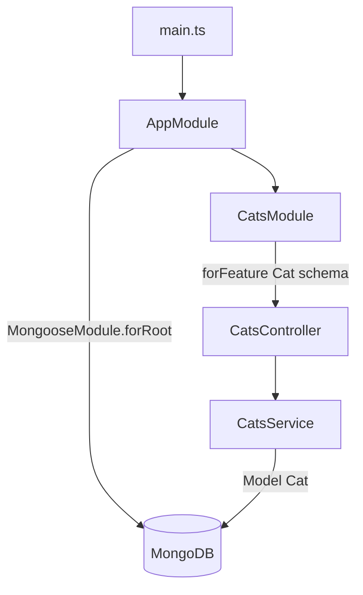

# 06-mongoose — NestJS Sample

REST CRUD for **cats** backed by **MongoDB** via **`@nestjs/mongoose`**. Demonstrates schema decorators, model injection with `@InjectModel`, and Mongoose document operations.

## Quick start

```bash
cd sample/06-mongoose
npm install
```

### Database setup

Requires MongoDB at `mongodb://localhost:27017/test` (see `AppModule`). Optional:

```bash
docker-compose up -d
```

```bash
npm run start:dev
```

App listens on **http://localhost:3000**.

| Method   | Path         | Description |
| -------- | ------------ | ----------- |
| `POST`   | `/cats`      | Create cat  |
| `GET`    | `/cats`      | List cats   |
| `GET`    | `/cats/:id`  | Get one cat |
| `PATCH`  | `/cats/:id`  | Update cat  |
| `DELETE` | `/cats/:id`  | Delete cat  |

---


<!-- CORE_INVENTORY_START -->
## Core elements inventory

> Generated from `06-mongoose/src`. **Wired** = registered in a module or applied globally. **Example** = present in code but not registered.

### Application type

| Property | Value |
| -------- | ----- |
| **Bootstrap** | `NestFactory.create(AppModule)` |
| **Kind** | HTTP server |
| **Entry file** | `main.ts` |
| **Port** | 3000 |

### Modules (2)

| Module | Path | Imports | Controllers | Providers |
| ------ | ---- | ------- | ----------- | --------- |
| `AppModule` | `src/app.module.ts` | `MongooseModule`, `CatsModule` | — | — |
| `CatsModule` | `src/cats/cats.module.ts` | `MongooseModule` | `CatsController` | `CatsService` |

### Controllers (1)

| Name | Path | Status |
| ---- | ---- | ------ |
| `CatsController` | `src/cats/cats.controller.ts` | **Wired** |

### Providers / services (1)

| Name | Path | Status |
| ---- | ---- | ------ |
| `CatsService` | `src/cats/cats.service.ts` | **Wired** |

### Guards (0)

_None_

### Interceptors (0)

_None_

### Pipes (0)

_None_

### Exception filters (0)

_None_

### Middleware (0)

_None_

### Decorators used (11)

| Library | Decorators |
| ------- | ---------- |
| **@nestjs (@nestjs/common)** | `@Body`, `@Controller`, `@Delete`, `@Get`, `@Injectable`, `@Module`, `@Param`, `@Post` |
| **@nestjs (@nestjs/mongoose)** | `@InjectModel`, `@Prop`, `@Schema` |

---
<!-- CORE_INVENTORY_END -->
## Project structure

```
sample/06-mongoose/
├── src/
│   ├── main.ts
│   ├── app.module.ts                 # MongooseModule.forRoot(...)
│   └── cats/
│       ├── cats.module.ts
│       ├── cats.controller.ts
│       ├── cats.service.ts
│       ├── schemas/cat.schema.ts
│       └── dto/
│           ├── create-cat.dto.ts
│           └── update-cat.dto.ts
└── docker-compose.yml
```

---

## How the app boots



---

## Module graph

| Component         | Path                              | Origin              | Role                    |
| ----------------- | --------------------------------- | ------------------- | ----------------------- |
| `AppModule`       | `src/app.module.ts`               | **User**            | Mongo connection        |
| `CatsModule`      | `src/cats/cats.module.ts`         | **User**            | Feature module          |
| `CatsController`  | `src/cats/cats.controller.ts`     | **User**            | HTTP CRUD               |
| `CatsService`     | `src/cats/cats.service.ts`        | **User**            | Mongoose operations     |
| `Cat` / `CatSchema` | `src/cats/schemas/cat.schema.ts`| **User** + **NestJS mongoose** | Document schema |

---

## Controller ↔ Service ↔ Model

```mermaid
flowchart LR
    CC[CatsController] --> CS[CatsService]
    CS -->|@InjectModel Cat.name| M[Model Cat]
    M --> DB[(MongoDB)]
```

| Controller method | Service method |
| ----------------- | -------------- |
| `create()`        | `create(dto)`  |
| `findAll()`       | `findAll()`    |
| `findOne()`       | `findOne(id)`  |
| `update()`        | `update(id, dto)` |
| `remove()`        | `remove(id)`   |

---

## Decorator glossary (`@`)

### NestJS

| Decorator                 | Used on           | Purpose                    |
| ------------------------- | ----------------- | -------------------------- |
| `@Module`                 | Modules           | Module declaration         |
| `@Controller('cats')`     | `CatsController`  | Route prefix               |
| `@Post`, `@Get`, `@Patch`, `@Delete` | Handlers | HTTP verbs        |
| `@Body`, `@Param`         | Parameters        | Body / id param            |
| `@Injectable`             | `CatsService`     | Injectable provider        |
| `@InjectModel(Cat.name)`  | `CatsService`     | Injects Mongoose model     |

### @nestjs/mongoose

| Decorator    | Used on        | Purpose                    |
| ------------ | -------------- | -------------------------- |
| `@Schema()`  | `Cat` class    | Defines Mongoose schema    |
| `@Prop()`    | Schema fields  | Field definition           |

**User-created decorators:** none. DTOs have no validation decorators in this sample.

---

## Mental model

1. **`MongooseModule.forRoot()`** connects to MongoDB once at app level.
2. **`MongooseModule.forFeature([{ name, schema }])`** registers a model per feature module.
3. **`@InjectModel(Cat.name)`** injects the typed `Model<Cat>` into the service.
4. Schemas use **`@Schema` / `@Prop`** instead of TypeORM's `@Entity` / `@Column`.

---

## Dependencies

`@nestjs/mongoose`, `mongoose`
