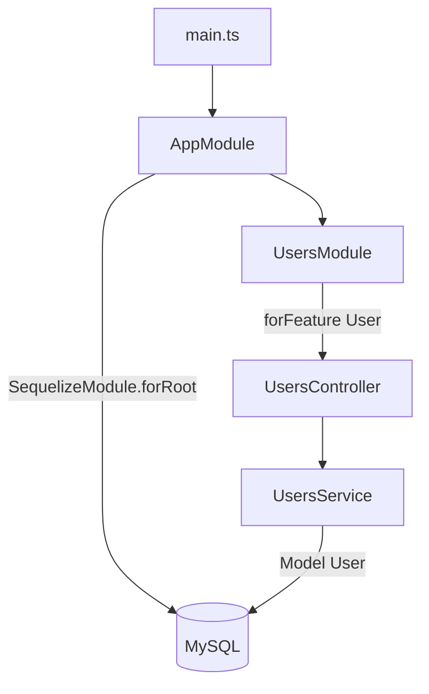

# 07-sequelize — NestJS Sample

REST CRUD for **users** backed by **MySQL** via **Sequelize** and **`@nestjs/sequelize`**. Same HTTP shape as `05-sql-typeorm`, but uses Sequelize model decorators and `@InjectModel`.

## Quick start

```bash
cd sample/07-sequelize
npm install
```

### Database setup

Requires MySQL. Use Docker or local install — credentials in `src/app.module.ts` must match your database.

```bash
docker-compose up -d
npm run start:dev
```

App listens on **http://localhost:3000**.

| Method   | Path           | Description   |
| -------- | -------------- | ------------- |
| `POST`   | `/users`       | Create user   |
| `GET`    | `/users`       | List users    |
| `GET`    | `/users/:id`   | Get one user  |
| `DELETE` | `/users/:id`   | Delete user   |

---


<!-- CORE_INVENTORY_START -->
## Core elements inventory

> Generated from `07-sequelize/src`. **Wired** = registered in a module or applied globally. **Example** = present in code but not registered.

### Application type

| Property | Value |
| -------- | ----- |
| **Bootstrap** | `NestFactory.create(AppModule)` |
| **Kind** | HTTP server |
| **Entry file** | `main.ts` |
| **Port** | 3000 |

### Modules (2)

| Module | Path | Imports | Controllers | Providers |
| ------ | ---- | ------- | ----------- | --------- |
| `AppModule` | `src/app.module.ts` | `SequelizeModule`, `UsersModule` | — | — |
| `UsersModule` | `src/users/users.module.ts` | `SequelizeModule` | `UsersController` | `UsersService` |

### Controllers (1)

| Name | Path | Status |
| ---- | ---- | ------ |
| `UsersController` | `src/users/users.controller.ts` | **Wired** |

### Providers / services (1)

| Name | Path | Status |
| ---- | ---- | ------ |
| `UsersService` | `src/users/users.service.ts` | **Wired** |

### Guards (0)

_None_

### Interceptors (0)

_None_

### Pipes (0)

_None_

### Exception filters (0)

_None_

### Middleware (0)

_None_

### Decorators used (11)

| Library | Decorators |
| ------- | ---------- |
| **@nestjs (@nestjs/common)** | `@Body`, `@Controller`, `@Delete`, `@Get`, `@Injectable`, `@Module`, `@Param`, `@Post` |
| **@nestjs (@nestjs/sequelize)** | `@InjectModel` |
| **NestJS** | `@Column`, `@Table` |

---
<!-- CORE_INVENTORY_END -->
## Project structure

```
sample/07-sequelize/
├── src/
│   ├── main.ts
│   ├── app.module.ts                 # SequelizeModule.forRoot(...)
│   └── users/
│       ├── users.module.ts
│       ├── users.controller.ts
│       ├── users.service.ts
│       ├── models/user.model.ts
│       └── dto/create-user.dto.ts
└── docker-compose.yml
```

---

## How the app boots



---

## Module graph

| Component         | Path                              | Origin                   | Role              |
| ----------------- | --------------------------------- | ------------------------ | ----------------- |
| `AppModule`       | `src/app.module.ts`               | **User**                 | DB connection     |
| `UsersModule`     | `src/users/users.module.ts`       | **User**                 | Feature module    |
| `UsersController` | `src/users/users.controller.ts`   | **User**                 | HTTP CRUD         |
| `UsersService`    | `src/users/users.service.ts`      | **User**                 | Sequelize ops     |
| `User`            | `src/users/models/user.model.ts`  | **User** + **sequelize-typescript** | Table model |

---

## Controller ↔ Service ↔ Model

```mermaid
flowchart LR
    UC[UsersController] --> US[UsersService]
    US -->|@InjectModel User| M[typeof User]
    M --> DB[(MySQL)]
```

---

## Decorator glossary (`@`)

### NestJS

| Decorator              | Used on           | Purpose                |
| ---------------------- | ----------------- | ---------------------- |
| `@Module`              | Modules           | Module declaration     |
| `@Controller('users')` | `UsersController` | Route prefix           |
| `@Post`, `@Get`, `@Delete` | Handlers      | HTTP verbs             |
| `@Body`, `@Param`      | Parameters        | Body / id              |
| `@Injectable`          | `UsersService`    | Injectable provider    |
| `@InjectModel(User)`   | `UsersService`    | Injects Sequelize model class |

### sequelize-typescript (third-party)

| Decorator   | Used on     | Purpose           |
| ----------- | ----------- | ----------------- |
| `@Table`    | `User` class| Maps to table     |
| `@Column`   | Fields      | Column mapping    |

**User-created decorators:** none.

---

## Comparison with sample 05

| Aspect        | 05-sql-typeorm        | 07-sequelize           |
| ------------- | --------------------- | ---------------------- |
| ORM           | TypeORM               | Sequelize              |
| Entity style  | `@Entity`, `@Column`  | `@Table`, `@Column`    |
| Injection     | `@InjectRepository`   | `@InjectModel`         |
| Nest package  | `@nestjs/typeorm`     | `@nestjs/sequelize`    |

---

## Dependencies

`@nestjs/sequelize`, `sequelize`, `sequelize-typescript`, `mysql2`
