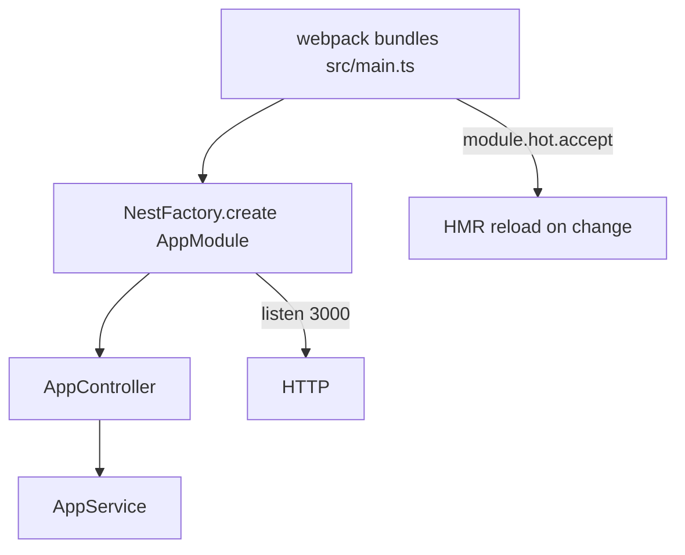
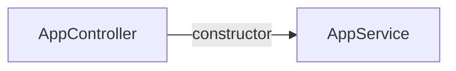

# 08-webpack — NestJS Sample

Minimal hello-world app demonstrating **Webpack Hot Module Replacement (HMR)** for Nest development. Code changes reload without restarting the full Node process when run via the webpack dev script.

## Quick start

```bash
cd sample/08-webpack
npm install
npm run start:dev    # webpack + HMR watch
```

Standard build (no HMR):

```bash
npm run build
npm run start:prod
```

App listens on **http://localhost:3000**.

| Method | Path | Response        |
| ------ | ---- | --------------- |
| `GET`  | `/`  | `Hello world!`  |

---


<!-- CORE_INVENTORY_START -->
## Core elements inventory

> Generated from `08-webpack/src`. **Wired** = registered in a module or applied globally. **Example** = present in code but not registered.

### Application type

| Property | Value |
| -------- | ----- |
| **Bootstrap** | `NestFactory.create(AppModule)` |
| **Kind** | HTTP server |
| **Entry file** | `main.ts` |
| **Port** | 3000 |

### Modules (1)

| Module | Path | Imports | Controllers | Providers |
| ------ | ---- | ------- | ----------- | --------- |
| `AppModule` | `src/app.module.ts` | — | `AppController` | `AppService` |

### Controllers (1)

| Name | Path | Status |
| ---- | ---- | ------ |
| `AppController` | `src/app.controller.ts` | **Wired** |

### Providers / services (1)

| Name | Path | Status |
| ---- | ---- | ------ |
| `AppService` | `src/app.service.ts` | **Wired** |

### Guards (0)

_None_

### Interceptors (0)

_None_

### Pipes (0)

_None_

### Exception filters (0)

_None_

### Middleware (0)

_None_

### Decorators used (4)

| Library | Decorators |
| ------- | ---------- |
| **@nestjs (@nestjs/common)** | `@Controller`, `@Get`, `@Injectable`, `@Module` |

---
<!-- CORE_INVENTORY_END -->
## Project structure

```
sample/08-webpack/
├── src/
│   ├── main.ts                       # HMR hooks (module.hot)
│   ├── app.module.ts
│   ├── app.controller.ts
│   └── app.service.ts
├── webpack-hmr.config.js
└── nest-cli.json
```

---

## How the app boots



HMR block in `main.ts`:

```javascript
if (module.hot) {
  module.hot.accept();
  module.hot.dispose(() => app.close());
}
```

---

## Module graph

| Component       | Path                      | Origin   | Role                    |
| --------------- | ------------------------- | -------- | ----------------------- |
| `AppModule`     | `src/app.module.ts`       | **User** | Root module             |
| `AppController` | `src/app.controller.ts`   | **User** | Single `GET /` route    |
| `AppService`    | `src/app.service.ts`      | **User** | Returns greeting string |



---

## Decorator glossary (`@`)

| Decorator        | Library  | Used on          | Purpose              |
| ---------------- | -------- | ---------------- | -------------------- |
| `@Module`        | **NestJS** | `AppModule`      | Module declaration   |
| `@Controller`    | **NestJS** | `AppController`  | HTTP controller      |
| `@Get`           | **NestJS** | `getHello`       | GET `/`              |
| `@Injectable`    | **NestJS** | `AppService`     | Injectable provider  |

**User-created decorators:** none.

---

## Webpack config highlights

| File                    | Role                                              |
| ----------------------- | ------------------------------------------------- |
| `webpack-hmr.config.js` | HMR entry, `HotModuleReplacementPlugin`, externals |
| `nest-cli.json`         | `deleteOutDir: true`                              |

Script: `build:dev` → `nest build --watch --webpack --webpackPath webpack-hmr.config.js`

---

## Mental model

1. **Normal `nest build`** compiles with `tsc` — no HMR.
2. **Webpack dev** bundles the app and swaps modules on change via `module.hot`.
3. **`app.close()`** on dispose prevents orphaned servers when HMR reloads.

---

## Dependencies

`webpack`, `webpack-cli`, `webpack-node-externals`, `start-server-webpack-plugin`, `ts-loader`
