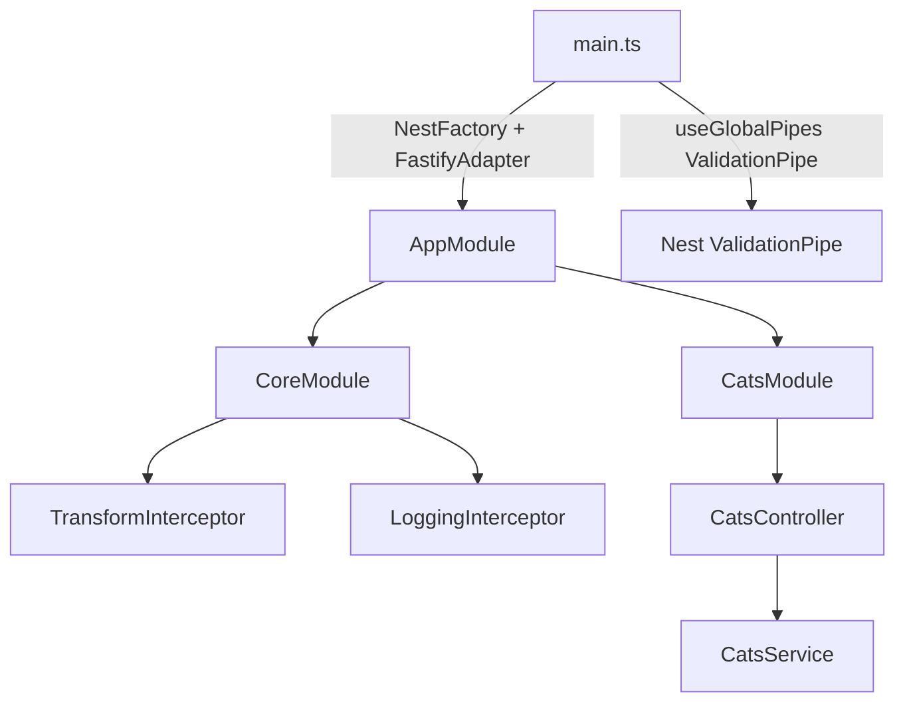

# 10-fastify — NestJS Sample

Same architectural patterns as `01-cats-app`, but running on the **Fastify adapter** instead of Express. Demonstrates guards, interceptors, pipes, and middleware examples with `@nestjs/platform-fastify`.

## Quick start

```bash
cd sample/10-fastify
npm install
npm run start:dev
```

App listens on **http://localhost:3000**.

> **Remote machines:** you may need `await app.listen(3000, '0.0.0.0')` — see [Nest performance docs](https://docs.nestjs.com/techniques/performance#adapter).

| Method | Path        | Description                                           |
| ------ | ----------- | ----------------------------------------------------- |
| `GET`  | `/cats`     | List cats (wrapped in `{ data: ... }` by interceptor) |
| `POST` | `/cats`     | Create cat (`@Roles('admin')` — needs `request.user`) |
| `GET`  | `/cats/:id` | Stub; parses `:id` with custom `ParseIntPipe`         |

---


<!-- CORE_INVENTORY_START -->
## Core elements inventory

> Generated from `10-fastify/src`. **Wired** = registered in a module or applied globally. **Example** = present in code but not registered.

### Application type

| Property | Value |
| -------- | ----- |
| **Bootstrap** | `Unknown` |
| **Kind** | Unknown |
| **Entry file** | `main.ts` |
| **Port** | 3000 |

**Stack notes:** HTTP adapter: **Fastify**

**Global setup (`main.ts`):** `ValidationPipe` (global, `@nestjs/common`)

### Modules (3)

| Module | Path | Imports | Controllers | Providers |
| ------ | ---- | ------- | ----------- | --------- |
| `AppModule` | `src/app.module.ts` | `CatsModule`, `CoreModule` | — | — |
| `CatsModule` | `src/cats/cats.module.ts` | — | `CatsController` | `CatsService` |
| `CoreModule` | `src/core/core.module.ts` | — | — | `TransformInterceptor`, `LoggingInterceptor` |

### Controllers (1)

| Name | Path | Status |
| ---- | ---- | ------ |
| `CatsController` | `src/cats/cats.controller.ts` | **Wired** |

### Providers / services (1)

| Name | Path | Status |
| ---- | ---- | ------ |
| `CatsService` | `src/cats/cats.service.ts` | **Wired** |

### Guards (1)

| Name | Path | Status |
| ---- | ---- | ------ |
| `RolesGuard` | `src/common/guards/roles.guard.ts` | **Wired** |

### Interceptors (3)

| Name | Path | Status |
| ---- | ---- | ------ |
| `ExceptionInterceptor` | `src/common/interceptors/exception.interceptor.ts` | Example (not registered) |
| `LoggingInterceptor` | `src/core/interceptors/logging.interceptor.ts` | **Wired** |
| `TransformInterceptor` | `src/core/interceptors/transform.interceptor.ts` | **Wired** |

### Pipes (2)

| Name | Path | Status |
| ---- | ---- | ------ |
| `ParseIntPipe` | `src/common/pipes/parse-int.pipe.ts` | **Wired** |
| `ValidationPipe` | `src/common/pipes/validation.pipe.ts` | Example (not registered) |

### Exception filters (0)

_None_

### Middleware (1)

| Name | Path | Status |
| ---- | ---- | ------ |
| `LoggerMiddleware` | `src/common/middleware/logger.middleware.ts` | Example (not registered) |

### Decorators used (11)

| Library | Decorators |
| ------- | ---------- |
| **@nestjs (@nestjs/common)** | `@Body`, `@Controller`, `@Get`, `@Injectable`, `@Module`, `@Param`, `@Post`, `@UseGuards` |
| **User-created** | `@Roles` |
| **class-validator** | `@IsInt`, `@IsString` |

---
<!-- CORE_INVENTORY_END -->
## Project structure

```
sample/10-fastify/
├── src/
│   ├── main.ts                       # FastifyAdapter + global ValidationPipe
│   ├── app.module.ts
│   ├── cats/                         # Feature module (active)
│   ├── core/                         # Global interceptors (active)
│   └── common/                       # Guards, pipes, etc. (mixed)
```

Structure mirrors `01-cats-app` — compare the two samples to see Express vs Fastify bootstrap differences.

---

## How the app boots



Key difference from `01-cats-app`:

```typescript
const app = await NestFactory.create(AppModule, new FastifyAdapter());
```

---

## Module graph

| Component              | Origin   | Registered in              | Role                         |
| ---------------------- | -------- | -------------------------- | ---------------------------- |
| `AppModule`            | **User** | Root                       | Composes modules             |
| `CoreModule`           | **User** | `AppModule.imports`        | Global interceptors          |
| `CatsModule`           | **User** | `AppModule.imports`        | Cats feature                 |
| `CatsController`       | **User** | `CatsModule.controllers`   | HTTP routes                  |
| `CatsService`          | **User** | `CatsModule.providers`     | In-memory store              |
| `RolesGuard`           | **User** | `@UseGuards` on controller | Reads `@Roles` metadata      |
| `Roles` decorator      | **User** | —                          | `SetMetadata('roles', roles)` |

---

## Decorator glossary (`@`)

### NestJS

| Decorator            | Used on              | Purpose                    |
| -------------------- | -------------------- | -------------------------- |
| `@Module`            | Modules              | Module declaration         |
| `@Controller('cats')`| `CatsController`     | Route prefix               |
| `@Post`, `@Get`      | Handlers             | HTTP verbs                 |
| `@Body`, `@Param`    | Parameters           | Body / route param         |
| `@UseGuards(RolesGuard)` | Controller     | Applies guard              |
| `@Injectable`        | Services, guards, pipes, interceptors | DI marker |

### class-validator (third-party)

| Decorator   | Used on           | Purpose          |
| ----------- | ----------------- | ---------------- |
| `@IsString`, `@IsInt` | `CreateCatDto` | DTO validation   |

### User-created

| Decorator / helper | File                              | Purpose                    |
| ------------------ | --------------------------------- | -------------------------- |
| `Roles(...)`       | `common/decorators/roles.decorator.ts` | `SetMetadata('roles', roles)` |

Unlike `01-cats-app`, this sample uses `SetMetadata` instead of `Reflector.createDecorator`.

---

## Wired vs example-only

| Wired | Example-only |
| ----- | ------------ |
| Fastify adapter, global `ValidationPipe` | `LoggerMiddleware` (not applied) |
| `CoreModule` interceptors | `ExceptionInterceptor` (not registered) |
| `RolesGuard` on controller | Custom `ValidationPipe` in `common/` (superseded by global) |
| | `findOne` stub — no service call |

---

## Mental model

Fastify is a faster HTTP framework; Nest abstracts it via **`FastifyAdapter`**. Everything else (modules, DI, decorators) works the same as Express-based Nest apps.

---

## Dependencies

`@nestjs/platform-fastify`, `class-validator`, `class-transformer`
