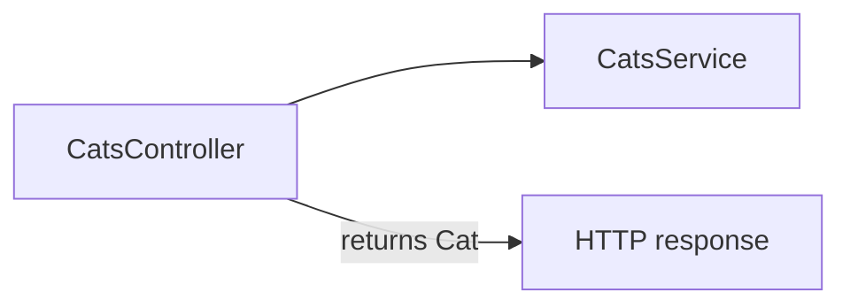

# 11-swagger — NestJS Sample

REST API for cats with **OpenAPI (Swagger)** documentation. Demonstrates `@nestjs/swagger` decorators to generate an interactive API spec at `/api`.

## Quick start

```bash
cd sample/11-swagger
npm install
npm run start:dev
```

- API: **http://localhost:3000**
- Swagger UI: **http://localhost:3000/api**

| Method | Path        | Description   |
| ------ | ----------- | ------------- |
| `POST` | `/cats`     | Create cat    |
| `GET`  | `/cats/:id` | Get cat by id |

---


<!-- CORE_INVENTORY_START -->
## Core elements inventory

> Generated from `11-swagger/src`. **Wired** = registered in a module or applied globally. **Example** = present in code but not registered.

### Application type

| Property | Value |
| -------- | ----- |
| **Bootstrap** | `NestFactory.create(AppModule)` |
| **Kind** | HTTP server |
| **Entry file** | `main.ts` |
| **Port** | 3000 |

### Modules (2)

| Module | Path | Imports | Controllers | Providers |
| ------ | ---- | ------- | ----------- | --------- |
| `AppModule` | `src/app.module.ts` | `CatsModule` | — | — |
| `CatsModule` | `src/cats/cats.module.ts` | — | `CatsController` | `CatsService` |

### Controllers (1)

| Name | Path | Status |
| ---- | ---- | ------ |
| `CatsController` | `src/cats/cats.controller.ts` | **Wired** |

### Providers / services (1)

| Name | Path | Status |
| ---- | ---- | ------ |
| `CatsService` | `src/cats/cats.service.ts` | **Wired** |

### Guards (0)

_None_

### Interceptors (0)

_None_

### Pipes (0)

_None_

### Exception filters (0)

_None_

### Middleware (0)

_None_

### Decorators used (15)

| Library | Decorators |
| ------- | ---------- |
| **@nestjs (@nestjs/common)** | `@Body`, `@Controller`, `@Get`, `@Injectable`, `@Module`, `@Param`, `@Post` |
| **@nestjs (@nestjs/swagger)** | `@ApiBearerAuth`, `@ApiOperation`, `@ApiProperty`, `@ApiResponse`, `@ApiTags` |
| **Unknown** | `@example` |
| **class-validator** | `@IsInt`, `@IsString` |

---
<!-- CORE_INVENTORY_END -->
## Project structure

```
sample/11-swagger/
├── src/
│   ├── main.ts                       # DocumentBuilder + SwaggerModule.setup
│   ├── app.module.ts
│   └── cats/
│       ├── cats.module.ts
│       ├── cats.controller.ts
│       ├── cats.service.ts
│       ├── entities/cat.entity.ts    # Swagger schema class (not a DB entity)
│       └── dto/create-cat.dto.ts
```

---

## How the app boots

```mermaid
flowchart TD
    A[main.ts] --> B[AppModule]
    B --> C[CatsModule]
    C --> D[CatsController]
    D --> E[CatsService]
    A -->|SwaggerModule.setup api| F[OpenAPI at /api]
    D -->|@ApiTags @ApiOperation| F
```

Swagger setup in `main.ts`:

```typescript
const config = new DocumentBuilder()
  .setTitle('Cats example')
  .setDescription('The cats API description')
  .setVersion('1.0')
  .addBearerAuth()
  .addTag('cats')
  .build();
const document = SwaggerModule.createDocument(app, config);
SwaggerModule.setup('api', app, document);
```

---

## Module graph

| Component         | Origin              | Role                              |
| ----------------- | ------------------- | --------------------------------- |
| `AppModule`       | **User**            | Root                              |
| `CatsModule`      | **User**            | Feature module                    |
| `CatsController`  | **User**            | HTTP + Swagger metadata           |
| `CatsService`     | **User**            | In-memory cat store               |
| `Cat` entity class| **User**            | OpenAPI response schema           |



---

## Decorator glossary (`@`)

### NestJS

| Decorator              | Used on          | Purpose              |
| ---------------------- | ---------------- | -------------------- |
| `@Module`              | Modules          | Module declaration   |
| `@Controller('cats')`  | Controller       | Route prefix         |
| `@Post`, `@Get`        | Handlers         | HTTP verbs           |
| `@Body`, `@Param`      | Parameters       | Body / id            |
| `@Injectable`          | `CatsService`    | Injectable provider  |

### @nestjs/swagger (third-party Nest package)

| Decorator          | Used on              | Purpose                    |
| ------------------ | -------------------- | -------------------------- |
| `@ApiTags('cats')` | `CatsController`     | Groups endpoints in UI     |
| `@ApiBearerAuth()` | `CatsController`     | Documents auth header      |
| `@ApiOperation`    | `create`             | Operation summary          |
| `@ApiResponse`     | Handlers             | Response schema / status   |
| `@ApiProperty`     | `Cat` entity fields  | Schema property docs       |

### class-validator

| Decorator   | Used on `CreateCatDto` | Purpose        |
| ----------- | ---------------------- | -------------- |
| `@IsString`, `@IsInt` | Fields         | Validation (not enforced — no global ValidationPipe) |

**User-created decorators:** none.

---

## Wired vs example-only

| Wired | Example-only |
| ----- | ------------ |
| Swagger UI at `/api` | `@ApiBearerAuth` — no auth implemented |
| In-memory CRUD | DTO validators not enforced at runtime |

---

## Dependencies

`@nestjs/swagger`, `class-validator`, `class-transformer`
