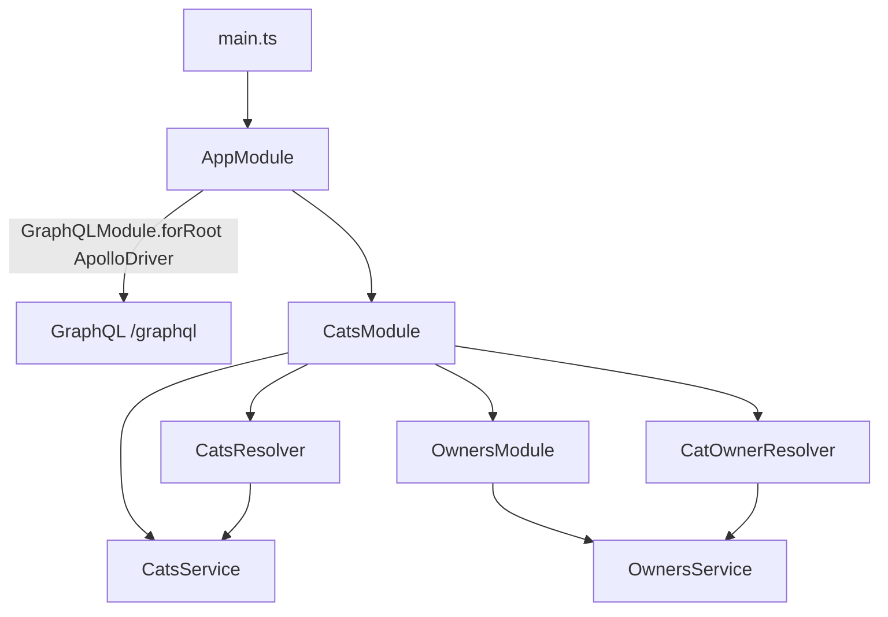
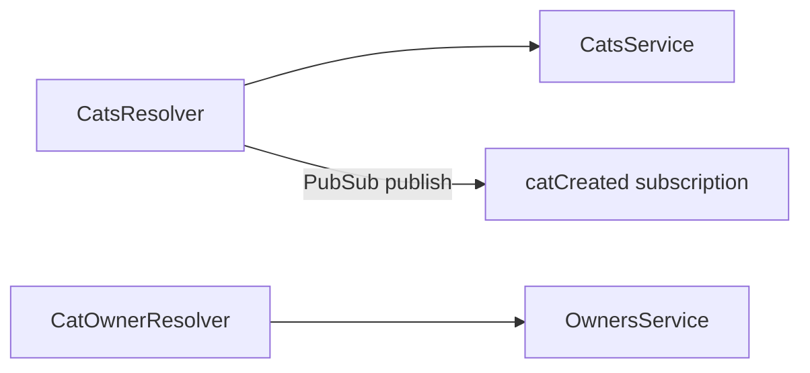

# 12-graphql-schema-first — NestJS Sample

**GraphQL schema-first** API with Apollo driver. SDL lives in `.graphql` files; TypeScript types are generated into `graphql.schema.ts`. Includes queries, mutations, subscriptions, field resolvers, guards, and a custom directive transformer.

## Quick start

```bash
cd sample/12-graphql-schema-first
npm install
npm run start:dev
```

GraphQL Playground: **http://localhost:3000/graphql**

Regenerate TS typings from SDL (when schema changes):

```bash
npm run generate:typings
```

---


<!-- CORE_INVENTORY_START -->
## Core elements inventory

> Generated from `12-graphql-schema-first/src`. **Wired** = registered in a module or applied globally. **Example** = present in code but not registered.

### Application type

| Property | Value |
| -------- | ----- |
| **Bootstrap** | `NestFactory.create(AppModule)` |
| **Kind** | HTTP server |
| **Entry file** | `main.ts` |
| **Port** | 3000 |

**Stack notes:** GraphQL endpoint enabled

**Global setup (`main.ts`):** `ValidationPipe` (global, `@nestjs/common`)

### Modules (3)

| Module | Path | Imports | Controllers | Providers |
| ------ | ---- | ------- | ----------- | --------- |
| `AppModule` | `src/app.module.ts` | `CatsModule`, `GraphQLModule` | — | — |
| `CatsModule` | `src/cats/cats.module.ts` | `OwnersModule` | — | `CatsService` |
| `OwnersModule` | `src/owners/owners.module.ts` | — | — | `OwnersService` |

### Controllers (0)

_None_

### GraphQL resolvers (2)

| Name | Path | Status |
| ---- | ---- | ------ |
| `CatOwnerResolver` | `src/cats/cat-owner.resolver.ts` | Example (not registered) |
| `CatsResolver` | `src/cats/cats.resolver.ts` | Example (not registered) |

### Providers / services (2)

| Name | Path | Status |
| ---- | ---- | ------ |
| `CatsService` | `src/cats/cats.service.ts` | **Wired** |
| `OwnersService` | `src/owners/owners.service.ts` | **Wired** |

### Guards (1)

| Name | Path | Status |
| ---- | ---- | ------ |
| `CatsGuard` | `src/cats/cats.guard.ts` | **Wired** |

### Interceptors (0)

_None_

### Pipes (0)

_None_

### Exception filters (0)

_None_

### Middleware (0)

_None_

### Decorators used (15)

| Library | Decorators |
| ------- | ---------- |
| **@nestjs (@nestjs/apollo)** | `@Plugin` |
| **@nestjs (@nestjs/common)** | `@Injectable`, `@Module`, `@UseGuards` |
| **@nestjs (@nestjs/graphql)** | `@Args`, `@Mutation`, `@Parent`, `@Query`, `@ResolveField`, `@Resolver`, `@Scalar`, `@Subscription` |
| **Unknown** | `@apollo`, `@graphql` |
| **class-validator** | `@Min` |

---
<!-- CORE_INVENTORY_END -->
## Project structure

```
sample/12-graphql-schema-first/
├── src/
│   ├── main.ts
│   ├── app.module.ts
│   ├── graphql.schema.ts             # Auto-generated from .graphql
│   ├── cats/
│   │   ├── cats.module.ts
│   │   ├── cats.graphql
│   │   ├── cats.resolver.ts
│   │   ├── cat-owner.resolver.ts     # @ResolveField owner
│   │   ├── cats.service.ts
│   │   ├── cats.guard.ts
│   │   └── dto/create-cat.dto.ts
│   ├── owners/
│   │   ├── owners.module.ts
│   │   └── owners.service.ts
│   └── common/
│       ├── directives/upper-case.directive.ts
│       ├── plugins/logging.plugin.ts
│       └── scalars/date.scalar.ts
├── generate-typings.ts
└── nest-cli.json                     # Copies **/*.graphql to dist
```

---

## How the app boots



---

## Module graph

| Component          | Origin   | Registered in           | Role                          |
| ------------------ | -------- | ----------------------- | ----------------------------- |
| `AppModule`        | **User** | Root                    | GraphQL + imports             |
| `CatsModule`       | **User** | `AppModule`             | Resolvers + cats service      |
| `OwnersModule`     | **User** | `CatsModule.imports`    | Owner lookup (exported)       |
| `CatsResolver`     | **User** | `CatsModule.providers`  | Queries, mutations, subs    |
| `CatOwnerResolver` | **User** | `CatsModule.providers`  | `Cat.owner` field resolver    |
| `CatsService`      | **User** | `CatsModule.providers`  | In-memory cats                |
| `OwnersService`    | **User** | `OwnersModule.providers`| In-memory owners              |
| `CatsGuard`        | **User** | `@UseGuards` on query   | Placeholder (always `true`)   |



---

## Resolver methods

| Resolver method   | GraphQL op        | Service / notes                    |
| ----------------- | ----------------- | ---------------------------------- |
| `getCats()`       | `Query cats`      | `catsService.findAll()` + guard    |
| `findOneById()`   | `Query cat`       | `catsService.findOneById(id)`      |
| `create()`        | `Mutation createCat` | Creates + publishes subscription |
| `catCreated()`    | `Subscription catCreated` | `PubSub` async iterator          |
| `getOwner()`      | `Cat.owner` field | `ownersService.findOneById`        |

---

## Decorator glossary (`@`)

### NestJS GraphQL

| Decorator           | Used on              | Purpose                         |
| ------------------- | -------------------- | ------------------------------- |
| `@Module`           | Modules              | Module declaration              |
| `@Resolver('Cat')`  | Resolvers            | Binds to GraphQL type           |
| `@Query('cats')`    | `getCats`            | Schema-first query name         |
| `@Mutation('createCat')` | `create`        | Schema-first mutation           |
| `@Subscription('catCreated')` | `catCreated` | Subscription handler      |
| `@Args`, `@Args('id')` | Parameters      | GraphQL arguments               |
| `@ResolveField('owner')` | `getOwner`     | Field resolver                  |
| `@Parent()`         | Field resolver param | Parent object                   |
| `@UseGuards(CatsGuard)` | `getCats`      | Guard on resolver               |
| `@Injectable`       | Services, guard      | DI marker                       |
| `@Scalar`           | `DateScalar`         | Custom scalar (not wired)       |
| `@Plugin`           | `LoggingPlugin`      | Apollo plugin (not wired)       |

### class-validator

| Decorator | Used on `CreateCatDto` |
| --------- | ---------------------- |
| `@Min`    | Validation             |

**User-created:** `upperDirectiveTransformer` is a plain function (not a decorator), registered in `GraphQLModule.forRoot({ transformSchema })`.

---

## Wired vs example-only

| Wired | Example-only |
| ----- | ------------ |
| Schema from `cats.graphql`, resolvers, subscriptions | `DateScalar` — not in any module |
| `upperDirectiveTransformer` registered | No `@upper` in SDL (transformer unused) |
| `CatsGuard` on `cats` query | `LoggingPlugin` — not registered |

---

## Dependencies

`@nestjs/graphql`, `@nestjs/apollo`, `@apollo/server`, `graphql`, `graphql-subscriptions`, `@graphql-tools/utils`
