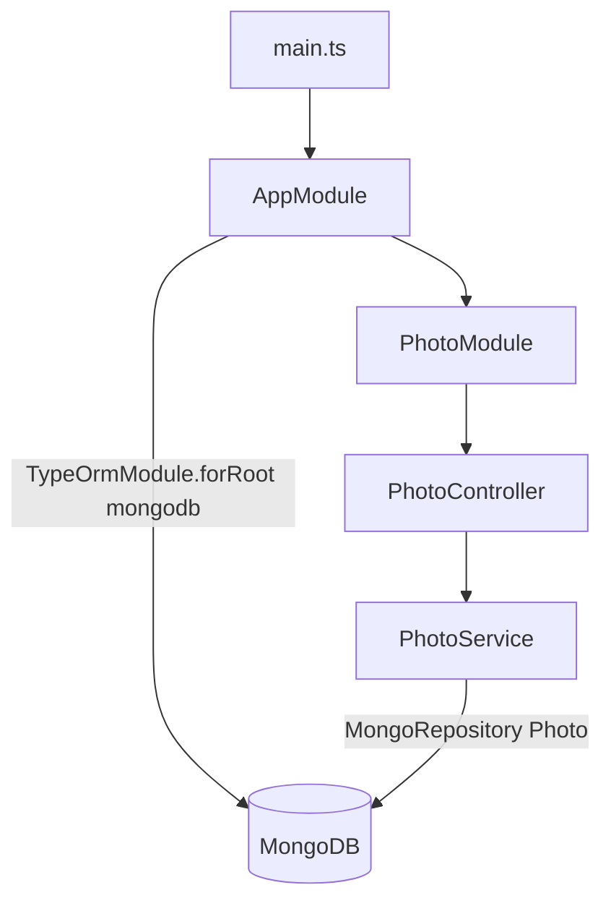

# 13-mongo-typeorm — NestJS Sample

MongoDB persistence via **TypeORM** (not Mongoose). A minimal **Photo** read API showing `@ObjectIdColumn` entities and repository injection against Mongo.

## Quick start

```bash
cd sample/13-mongo-typeorm
npm install
docker-compose up -d    # MongoDB on :27017
npm run start:dev
```

App listens on **http://localhost:3000**.

| Method | Path     | Description  |
| ------ | -------- | ------------ |
| `GET`  | `/photo` | List photos  |

---


<!-- CORE_INVENTORY_START -->
## Core elements inventory

> Generated from `13-mongo-typeorm/src`. **Wired** = registered in a module or applied globally. **Example** = present in code but not registered.

### Application type

| Property | Value |
| -------- | ----- |
| **Bootstrap** | `NestFactory.create(AppModule)` |
| **Kind** | HTTP server |
| **Entry file** | `main.ts` |
| **Port** | 3000 |

### Modules (2)

| Module | Path | Imports | Controllers | Providers |
| ------ | ---- | ------- | ----------- | --------- |
| `AppModule` | `src/app.module.ts` | `TypeOrmModule`, `PhotoModule` | — | — |
| `PhotoModule` | `src/photo/photo.module.ts` | `TypeOrmModule` | `PhotoController` | `PhotoService` |

### Controllers (1)

| Name | Path | Status |
| ---- | ---- | ------ |
| `PhotoController` | `src/photo/photo.controller.ts` | **Wired** |

### Providers / services (1)

| Name | Path | Status |
| ---- | ---- | ------ |
| `PhotoService` | `src/photo/photo.service.ts` | **Wired** |

### Guards (0)

_None_

### Interceptors (0)

_None_

### Pipes (0)

_None_

### Exception filters (0)

_None_

### Middleware (0)

_None_

### Decorators used (8)

| Library | Decorators |
| ------- | ---------- |
| **@nestjs (@nestjs/common)** | `@Controller`, `@Get`, `@Injectable`, `@Module` |
| **@nestjs (@nestjs/typeorm)** | `@InjectRepository` |
| **NestJS** | `@Column`, `@Entity`, `@ObjectIdColumn` |

---
<!-- CORE_INVENTORY_END -->
## Project structure

```
sample/13-mongo-typeorm/
├── src/
│   ├── main.ts
│   ├── app.module.ts                 # TypeOrmModule.forRoot type: mongodb
│   └── photo/
│       ├── photo.module.ts
│       ├── photo.controller.ts
│       ├── photo.service.ts
│       └── photo.entity.ts
└── docker-compose.yml
```

---

## How the app boots



---

## Module graph

| Component         | Origin              | Role                    |
| ----------------- | ------------------- | ----------------------- |
| `AppModule`       | **User**            | Mongo connection        |
| `PhotoModule`     | **User**            | Feature module          |
| `PhotoController` | **User**            | `GET /photo`            |
| `PhotoService`    | **User**            | `findAll()`             |
| `Photo` entity    | **User** + **TypeORM** | Mongo document mapping |

---

## Controller ↔ Service

```mermaid
flowchart LR
    PC[PhotoController] --> PS[PhotoService]
    PS -->|@InjectRepository Photo| R[MongoRepository]
```

Only `findAll()` is implemented — no create/update/delete.

---

## Decorator glossary (`@`)

### NestJS

| Decorator                 | Used on           | Purpose              |
| ------------------------- | ----------------- | -------------------- |
| `@Module`                 | Modules           | Module declaration   |
| `@Controller('photo')`    | Controller        | Route prefix         |
| `@Get`                    | `findAll`         | HTTP GET             |
| `@Injectable`             | `PhotoService`    | Injectable provider  |
| `@InjectRepository(Photo)`| Service         | Mongo repository     |

### TypeORM

| Decorator           | Used on   | Purpose              |
| ------------------- | --------- | -------------------- |
| `@Entity()`         | `Photo`   | Document entity      |
| `@ObjectIdColumn()` | `id`      | Mongo ObjectId       |
| `@Column()`         | Fields    | Field mapping        |

**User-created decorators:** none.

---

## Dependencies

`@nestjs/typeorm`, `typeorm`, `mongodb`
