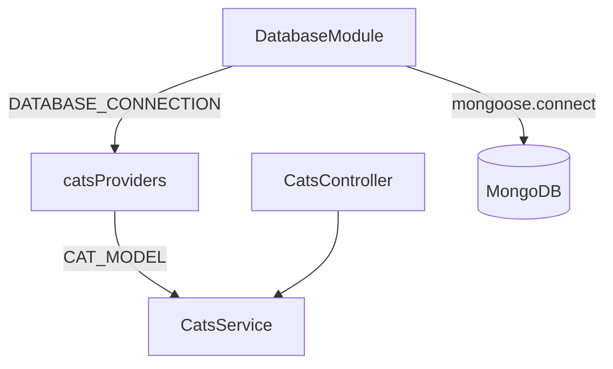

# 14-mongoose-base — NestJS Sample

MongoDB with **raw Mongoose** and **custom providers** — no `@nestjs/mongoose`. Demonstrates manual `useFactory` wiring for connection and model tokens.

## Quick start

```bash
cd sample/14-mongoose-base
npm install
# MongoDB required at mongodb://localhost/test
npm run start:dev
```

App listens on **http://localhost:3000**.

| Method | Path    | Description |
| ------ | ------- | ----------- |
| `POST` | `/cats` | Create cat  |
| `GET`  | `/cats` | List cats   |

---


<!-- CORE_INVENTORY_START -->
## Core elements inventory

> Generated from `14-mongoose-base/src`. **Wired** = registered in a module or applied globally. **Example** = present in code but not registered.

### Application type

| Property | Value |
| -------- | ----- |
| **Bootstrap** | `NestFactory.create(AppModule)` |
| **Kind** | HTTP server |
| **Entry file** | `main.ts` |
| **Port** | 3000 |

### Modules (3)

| Module | Path | Imports | Controllers | Providers |
| ------ | ---- | ------- | ----------- | --------- |
| `AppModule` | `src/app.module.ts` | `CatsModule` | — | — |
| `CatsModule` | `src/cats/cats.module.ts` | `DatabaseModule` | `CatsController` | `CatsService` |
| `DatabaseModule` | `src/database/database.module.ts` | — | — | — |

### Controllers (1)

| Name | Path | Status |
| ---- | ---- | ------ |
| `CatsController` | `src/cats/cats.controller.ts` | **Wired** |

### Providers / services (1)

| Name | Path | Status |
| ---- | ---- | ------ |
| `CatsService` | `src/cats/cats.service.ts` | **Wired** |

### Guards (0)

_None_

### Interceptors (0)

_None_

### Pipes (0)

_None_

### Exception filters (0)

_None_

### Middleware (0)

_None_

### Decorators used (7)

| Library | Decorators |
| ------- | ---------- |
| **@nestjs (@nestjs/common)** | `@Body`, `@Controller`, `@Get`, `@Inject`, `@Injectable`, `@Module`, `@Post` |

---
<!-- CORE_INVENTORY_END -->
## Project structure

```
sample/14-mongoose-base/
├── src/
│   ├── main.ts
│   ├── app.module.ts
│   ├── database/
│   │   ├── database.module.ts
│   │   └── database.providers.ts     # DATABASE_CONNECTION token
│   └── cats/
│       ├── cats.module.ts
│       ├── cats.controller.ts
│       ├── cats.service.ts
│       ├── cats.providers.ts         # CAT_MODEL token
│       ├── schemas/cat.schema.ts
│       └── dto/create-cat.dto.ts
```

---

## Provider chain (DI)



| Token                 | Provider file              | Value                          |
| --------------------- | -------------------------- | ------------------------------ |
| `DATABASE_CONNECTION` | `database.providers.ts`    | Mongoose connection instance   |
| `CAT_MODEL`           | `cats.providers.ts`        | `mongoose.model('Cat', schema)`|

---

## Module graph

| Component        | Origin   | Role                              |
| ---------------- | -------- | --------------------------------- |
| `AppModule`      | **User** | Imports `CatsModule`              |
| `DatabaseModule` | **User** | Exports connection provider       |
| `CatsModule`     | **User** | Imports DB + registers cat model  |
| `CatsController` | **User** | HTTP handlers                     |
| `CatsService`    | **User** | `@Inject('CAT_MODEL')`            |

---

## Decorator glossary (`@`)

### NestJS

| Decorator              | Used on          | Purpose                    |
| ---------------------- | ---------------- | -------------------------- |
| `@Module`              | Modules          | Module declaration         |
| `@Controller('cats')`  | Controller       | Route prefix               |
| `@Post`, `@Get`        | Handlers         | HTTP verbs                 |
| `@Body`                | Parameter        | Request body               |
| `@Injectable`          | `CatsService`    | Injectable provider        |
| `@Inject('CAT_MODEL')` | `CatsService`    | Injects custom model token |

**User-created decorators:** none. Schema uses plain `mongoose.Schema` (no `@Schema` / `@Prop`).

---

## vs sample 06-mongoose

| Aspect       | 06-mongoose              | 14-mongoose-base           |
| ------------ | ------------------------ | -------------------------- |
| Integration  | `@nestjs/mongoose`       | Custom providers           |
| Model inject | `@InjectModel(Cat.name)` | `@Inject('CAT_MODEL')`     |
| Schema       | `@Schema`, `@Prop`       | Plain Mongoose schema      |

---

## Dependencies

`mongoose` (no `@nestjs/mongoose`)
