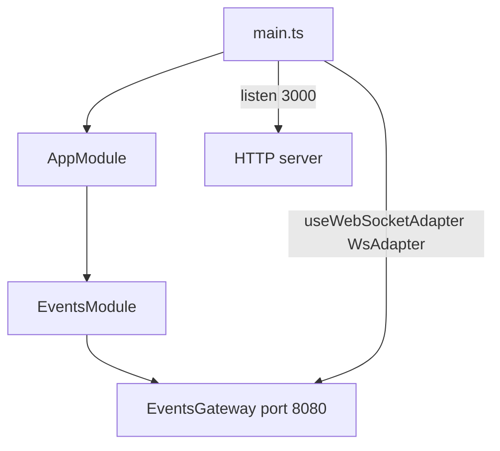

# 16-gateways-ws — NestJS Sample

WebSocket gateway using the native **`ws`** adapter (not Socket.IO). HTTP and WebSocket run on **different ports**.

## Quick start

```bash
cd sample/16-gateways-ws
npm install
npm run start:dev
```

- HTTP: **http://localhost:3000**
- WebSocket: **ws://localhost:8080**

| Event (client → server) | Response                          |
| ----------------------- | --------------------------------- |
| `events`                | Stream `{ event: 'events', data: 1|2|3 }` |

Test with `client/index.html` (manual, not served by Nest).

---


<!-- CORE_INVENTORY_START -->
## Core elements inventory

> Generated from `16-gateways-ws/src`. **Wired** = registered in a module or applied globally. **Example** = present in code but not registered.

### Application type

| Property | Value |
| -------- | ----- |
| **Bootstrap** | `NestFactory.create(AppModule)` |
| **Kind** | HTTP server |
| **Entry file** | `main.ts` |
| **Port** | 3000 |

**Stack notes:** WebSocket adapter configured

### Modules (2)

| Module | Path | Imports | Controllers | Providers |
| ------ | ---- | ------- | ----------- | --------- |
| `AppModule` | `src/app.module.ts` | `EventsModule` | — | — |
| `EventsModule` | `src/events/events.module.ts` | — | — | `EventsGateway` |

### Controllers (0)

_None_

### Gateways (1)

| Name | Path | Status |
| ---- | ---- | ------ |
| `EventsGateway` | `src/events/events.gateway.ts` | **Wired** |

### Providers / services (0)

_None_

### Guards (0)

_None_

### Interceptors (0)

_None_

### Pipes (0)

_None_

### Exception filters (0)

_None_

### Middleware (0)

_None_

### Decorators used (4)

| Library | Decorators |
| ------- | ---------- |
| **@nestjs (@nestjs/common)** | `@Module` |
| **@nestjs (@nestjs/websockets)** | `@SubscribeMessage`, `@WebSocketGateway`, `@WebSocketServer` |

---
<!-- CORE_INVENTORY_END -->
## Project structure

```
sample/16-gateways-ws/
├── src/
│   ├── main.ts                       # WsAdapter on port separate from HTTP
│   ├── app.module.ts
│   └── events/
│       ├── events.module.ts
│       └── events.gateway.ts
└── client/
    └── index.html
```

---

## How the app boots



```typescript
app.useWebSocketAdapter(new WsAdapter(app));
```

---

## Module graph

| Component       | Origin   | Role                         |
| --------------- | -------- | ---------------------------- |
| `AppModule`     | **User** | Imports `EventsModule`       |
| `EventsModule`  | **User** | Registers `EventsGateway`    |
| `EventsGateway` | **User** | `@WebSocketGateway(8080)`    |

Compare with **02-gateways** (Socket.IO, same port as HTTP).

---

## Gateway handler

```typescript
@WebSocketGateway(8080)
export class EventsGateway {
  @WebSocketServer()
  server: Server;  // ws Server

  @SubscribeMessage('events')
  onEvent(client, data): Observable<WsResponse<number>> { ... }
}
```

Note: handler receives `client` as first arg (ws adapter pattern).

---

## Decorator glossary (`@`)

| Decorator                    | Library  | Used on        | Purpose                    |
| ---------------------------- | -------- | -------------- | -------------------------- |
| `@Module`                    | **NestJS** | Modules      | Module declaration         |
| `@WebSocketGateway(8080)`    | **NestJS** | Gateway class| WS on port 8080            |
| `@WebSocketServer()`         | **NestJS** | `server` prop| Injects ws `Server`        |
| `@SubscribeMessage('events')`| **NestJS** | `onEvent`    | Message handler            |

**User-created decorators:** none.

---

## Dependencies

`@nestjs/websockets`, `@nestjs/platform-ws`, `ws`
