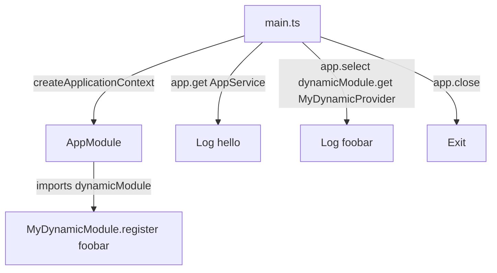
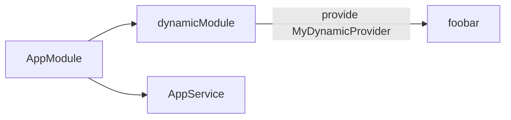

# 18-context — NestJS Sample

**Standalone application context** — no HTTP server. Demonstrates `NestFactory.createApplicationContext()` and resolving providers from a **dynamically registered module** via `ModuleRef.select()`.

## Quick start

```bash
cd sample/18-context
npm install
npm run start:dev
```

Output is **console logs only** — the app starts, resolves services, prints values, and exits.

---


<!-- CORE_INVENTORY_START -->
## Core elements inventory

> Generated from `18-context/src`. **Wired** = registered in a module or applied globally. **Example** = present in code but not registered.

### Application type

| Property | Value |
| -------- | ----- |
| **Bootstrap** | `NestFactory.createApplicationContext(AppModule)` |
| **Kind** | Standalone application context (no HTTP server) |
| **Entry file** | `main.ts` |

### Modules (2)

| Module | Path | Imports | Controllers | Providers |
| ------ | ---- | ------- | ----------- | --------- |
| `AppModule` | `src/app.module.ts` | `dynamicModule` | — | `AppService` |
| `MyDynamicModule` | `src/my-dynamic.module.ts` | — | — | `dyanmicProviderValue` |

### Controllers (0)

_None_

### Providers / services (1)

| Name | Path | Status |
| ---- | ---- | ------ |
| `AppService` | `src/app.service.ts` | **Wired** |

### Guards (0)

_None_

### Interceptors (0)

_None_

### Pipes (0)

_None_

### Exception filters (0)

_None_

### Middleware (0)

_None_

### Decorators used (2)

| Library | Decorators |
| ------- | ---------- |
| **@nestjs (@nestjs/common)** | `@Injectable`, `@Module` |

---
<!-- CORE_INVENTORY_END -->
## Project structure

```
sample/18-context/
├── src/
│   ├── main.ts
│   ├── app.module.ts
│   ├── app.service.ts
│   └── my-dynamic.module.ts
```

---

## How the app boots



Critical pattern in `app.module.ts`:

```typescript
export const dynamicModule = MyDynamicModule.register('foobar');

@Module({
  imports: [dynamicModule],
  providers: [AppService],
})
export class AppModule {}
```

You must `select(dynamicModule)` — **not** `select(MyDynamicModule)` — because only the registered instance exists in the DI graph.

---

## Module graph

| Component          | Origin   | Role                                      |
| ------------------ | -------- | ----------------------------------------- |
| `AppModule`        | **User** | Imports dynamic module + `AppService`     |
| `MyDynamicModule`  | **User** | `static register(options)` → `DynamicModule` |
| `AppService`       | **User** | Returns `'Hello World!'`                  |
| `MyDynamicProvider`| **User** | Token `'MyDynamicProvider'` → `useValue`  |



---

## Decorator glossary (`@`)

| Decorator     | Library  | Used on              | Purpose                    |
| ------------- | -------- | -------------------- | -------------------------- |
| `@Module`     | **NestJS** | `AppModule`, dynamic | Module declaration         |
| `@Injectable` | **NestJS** | `AppService`         | Injectable provider        |

**User-created decorators:** none.

---

## Mental model

1. **`createApplicationContext`** builds the DI container without starting HTTP.
2. **`app.get(Token)`** resolves any registered provider.
3. **`app.select(DynamicModuleInstance)`** scopes resolution to a submodule tree.
4. Dynamic modules must be **imported via their returned instance**, not the static class reference.

---

## Dependencies

`@nestjs/common`, `@nestjs/core` only
