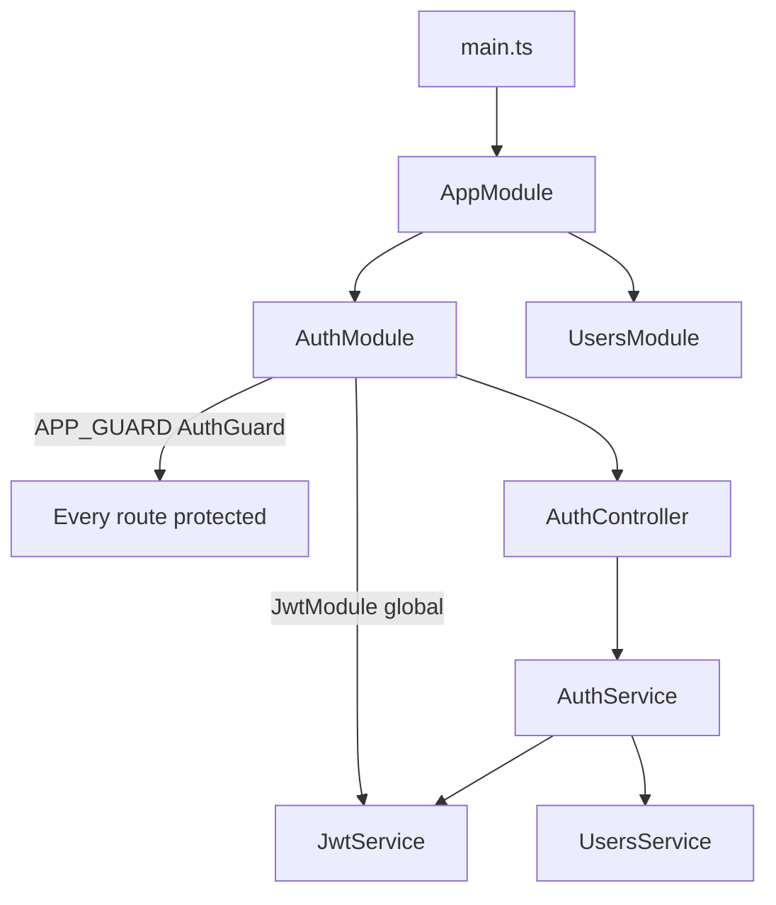
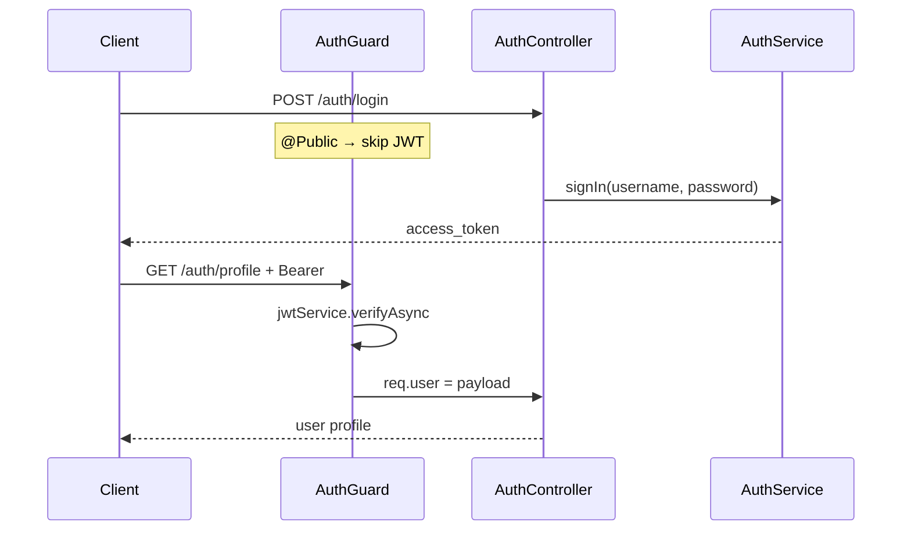

# 19-auth-jwt — NestJS Sample

**JWT authentication** with a **global guard** and **`@Public()`** opt-out. Custom `AuthGuard` verifies Bearer tokens; no Passport strategies in this sample.

## Quick start

```bash
cd sample/19-auth-jwt
npm install
npm run start:dev
```

App listens on **http://localhost:3000**.

| Method | Path            | Auth     | Description        |
| ------ | --------------- | -------- | ------------------ |
| `POST` | `/auth/login`   | Public   | Returns JWT        |
| `GET`  | `/auth/profile` | Bearer   | Returns JWT payload|

Example:

```bash
# Login
curl -X POST http://localhost:3000/auth/login \
  -H "Content-Type: application/json" \
  -d '{"username":"john","password":"changeme"}'

# Profile (use token from login)
curl http://localhost:3000/auth/profile \
  -H "Authorization: Bearer <token>"
```

---


<!-- CORE_INVENTORY_START -->
## Core elements inventory

> Generated from `19-auth-jwt/src`. **Wired** = registered in a module or applied globally. **Example** = present in code but not registered.

### Application type

| Property | Value |
| -------- | ----- |
| **Bootstrap** | `NestFactory.create(AppModule)` |
| **Kind** | HTTP server |
| **Entry file** | `main.ts` |
| **Port** | 3000 |

### Modules (3)

| Module | Path | Imports | Controllers | Providers |
| ------ | ---- | ------- | ----------- | --------- |
| `AppModule` | `src/app.module.ts` | `AuthModule`, `UsersModule` | — | — |
| `AuthModule` | `src/auth/auth.module.ts` | `UsersModule`, `JwtModule` | `AuthController` | `AuthGuard`, `AuthService` |
| `UsersModule` | `src/users/users.module.ts` | — | — | `UsersService` |

### Controllers (1)

| Name | Path | Status |
| ---- | ---- | ------ |
| `AuthController` | `src/auth/auth.controller.ts` | **Wired** |

### Providers / services (2)

| Name | Path | Status |
| ---- | ---- | ------ |
| `AuthService` | `src/auth/auth.service.ts` | **Wired** |
| `UsersService` | `src/users/users.service.ts` | **Wired** |

### Guards (1)

| Name | Path | Status |
| ---- | ---- | ------ |
| `AuthGuard` | `src/auth/auth.guard.ts` | **Wired** |

### Interceptors (0)

_None_

### Pipes (0)

_None_

### Exception filters (0)

_None_

### Middleware (0)

_None_

### Decorators used (9)

| Library | Decorators |
| ------- | ---------- |
| **@nestjs (@nestjs/common)** | `@Body`, `@Controller`, `@Get`, `@HttpCode`, `@Injectable`, `@Module`, `@Post`, `@Request` |
| **User-created** | `@Public` |

---
<!-- CORE_INVENTORY_END -->
## Project structure

```
sample/19-auth-jwt/
├── src/
│   ├── main.ts
│   ├── app.module.ts
│   ├── auth/
│   │   ├── auth.module.ts
│   │   ├── auth.controller.ts
│   │   ├── auth.service.ts
│   │   ├── auth.guard.ts
│   │   ├── constants.ts
│   │   └── decorators/public.decorator.ts
│   └── users/
│       ├── users.module.ts
│       └── users.service.ts
└── e2e/
```

---

## How the app boots



---

## Module graph

| Component      | Origin   | Registered in                    | Role                    |
| -------------- | -------- | -------------------------------- | ----------------------- |
| `AppModule`    | **User** | Root                             | Imports auth + users    |
| `AuthModule`   | **User** | `AppModule`                      | JWT, guard, controller  |
| `UsersModule`  | **User** | `AuthModule.imports`             | In-memory users (export)|
| `AuthGuard`    | **User** | `APP_GUARD` in `AuthModule`      | Global JWT verification |
| `AuthService`  | **User** | `AuthModule.providers`           | Login + token signing   |
| `UsersService` | **User** | `UsersModule.providers`          | User lookup             |

---

## Auth flow



---

## Decorator glossary (`@`)

### NestJS

| Decorator              | Used on              | Purpose                    |
| ---------------------- | -------------------- | -------------------------- |
| `@Module`              | Modules              | Module declaration         |
| `@Controller('auth')`  | `AuthController`     | Route prefix               |
| `@Post('login')`       | `signIn`             | Login endpoint             |
| `@Get('profile')`      | `getProfile`         | Protected route            |
| `@Body`, `@Request`    | Parameters           | Body / request with user   |
| `@HttpCode`            | `signIn`             | HTTP status                |
| `@Injectable`          | Services, guard      | DI marker                  |

### User-created

| Decorator / constant | File                              | Purpose                          |
| -------------------- | --------------------------------- | -------------------------------- |
| `@Public()`          | `auth/decorators/public.decorator.ts` | `SetMetadata('isPublic', true)` |
| `IS_PUBLIC_KEY`      | Same file                         | Metadata key read by guard       |

`AuthGuard` uses `Reflector.getAllAndOverride(IS_PUBLIC_KEY, ...)` to skip JWT on public routes.

---

## Wired vs example-only

| Wired | Example-only |
| ----- | ------------ |
| Global `AuthGuard`, JWT module | `@nestjs/passport` in package.json — **not used** |
| In-memory `UsersService` | Hardcoded secret in `constants.ts` |

---

## Dependencies

`@nestjs/jwt`, `@nestjs/passport` (unused), `rxjs`
