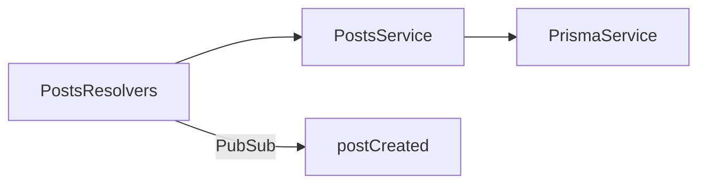

# 22-graphql-prisma — NestJS Sample

**Schema-first GraphQL** with **Prisma** (SQLite) and **subscriptions**. SDL in `.graphql` files; resolvers delegate to `PrismaService`.

## Quick start

```bash
cd sample/22-graphql-prisma
npm install
npx prisma generate
npm run start:dev
```

GraphQL: **http://localhost:3000/graphql**

Regenerate TS types from SDL:

```bash
npm run generate:typings
```

---


<!-- CORE_INVENTORY_START -->
## Core elements inventory

> Generated from `22-graphql-prisma/src`. **Wired** = registered in a module or applied globally. **Example** = present in code but not registered.

### Application type

| Property | Value |
| -------- | ----- |
| **Bootstrap** | `NestFactory.create(AppModule)` |
| **Kind** | HTTP server |
| **Entry file** | `main.ts` |
| **Port** | 3000 |

**Stack notes:** GraphQL endpoint enabled

**Global setup (`main.ts`):** `ValidationPipe` (global, `@nestjs/common`)

### Modules (3)

| Module | Path | Imports | Controllers | Providers |
| ------ | ---- | ------- | ----------- | --------- |
| `AppModule` | `src/app.module.ts` | `PostsModule`, `GraphQLModule` | — | — |
| `PostsModule` | `src/posts/posts.module.ts` | `PrismaModule` | — | `PostsResolvers` |
| `PrismaModule` | `src/prisma/prisma.module.ts` | — | — | `PrismaService` |

### Controllers (0)

_None_

### GraphQL resolvers (1)

| Name | Path | Status |
| ---- | ---- | ------ |
| `PostsResolvers` | `src/posts/posts.resolvers.ts` | **Wired** |

### Providers / services (2)

| Name | Path | Status |
| ---- | ---- | ------ |
| `PostsService` | `src/posts/posts.service.ts` | Example (not registered) |
| `PrismaService` | `src/prisma/prisma.service.ts` | **Wired** |

### Guards (0)

_None_

### Interceptors (0)

_None_

### Pipes (0)

_None_

### Exception filters (0)

_None_

### Middleware (0)

_None_

### Decorators used (8)

| Library | Decorators |
| ------- | ---------- |
| **@nestjs (@nestjs/common)** | `@Injectable`, `@Module` |
| **@nestjs (@nestjs/graphql)** | `@Args`, `@Mutation`, `@Query`, `@Resolver`, `@Subscription` |
| **Unknown** | `@prisma` |

---
<!-- CORE_INVENTORY_END -->
## Project structure

```
sample/22-graphql-prisma/
├── src/
│   ├── main.ts
│   ├── app.module.ts
│   ├── graphql.schema.ts             # Generated from .graphql
│   ├── posts/
│   │   ├── posts.module.ts
│   │   ├── posts.service.ts
│   │   ├── posts.resolvers.ts
│   │   └── schema.graphql
│   └── prisma/
│       ├── prisma.module.ts
│       └── prisma.service.ts
├── prisma/
│   └── schema.prisma                 # SQLite Post model
└── generate-typings.ts
```

---

## How the app boots

```mermaid
flowchart TD
    A[main.ts] --> B[AppModule]
    B -->|GraphQLModule Apollo schema-first| C[/graphql]
    B --> D[PostsModule]
    D --> E[PostsResolvers]
    D --> F[PostsService]
    F --> G[PrismaService]
    G --> H[(SQLite dev.db)]
```

---

## Module graph

| Component       | Origin   | Role                           |
| --------------- | -------- | ------------------------------ |
| `AppModule`     | **User** | GraphQL + imports              |
| `PostsModule`   | **User** | Resolvers + service            |
| `PrismaModule`  | **User** | Exports `PrismaService`        |
| `PostsResolvers`| **User** | Query, mutation, subscription  |
| `PostsService`  | **User** | Prisma CRUD                    |
| `PrismaService` | **User** | Extends `PrismaClient`         |



---

## Decorator glossary (`@`)

### NestJS GraphQL

| Decorator              | Used on              | Purpose                |
| ---------------------- | -------------------- | ---------------------- |
| `@Module`              | Modules              | Module declaration     |
| `@Injectable`          | Services             | DI marker              |
| `@Resolver('Post')`    | `PostsResolvers`     | GraphQL type binding   |
| `@Query()`             | Query handlers       | Read operations        |
| `@Mutation()`          | Mutation handlers    | Write operations       |
| `@Subscription()`      | Subscription handler | Real-time events       |
| `@Args()`              | Parameters           | GraphQL arguments      |

**User-created decorators:** none.

---

## Dependencies

`@nestjs/graphql`, `@nestjs/apollo`, `@prisma/client`, `@prisma/adapter-better-sqlite3`, `prisma`, `graphql-subscriptions`

---

## Mental model

Combines **schema-first GraphQL** (SDL files) with **Prisma** as the data layer — resolvers stay thin and services encapsulate DB access.
