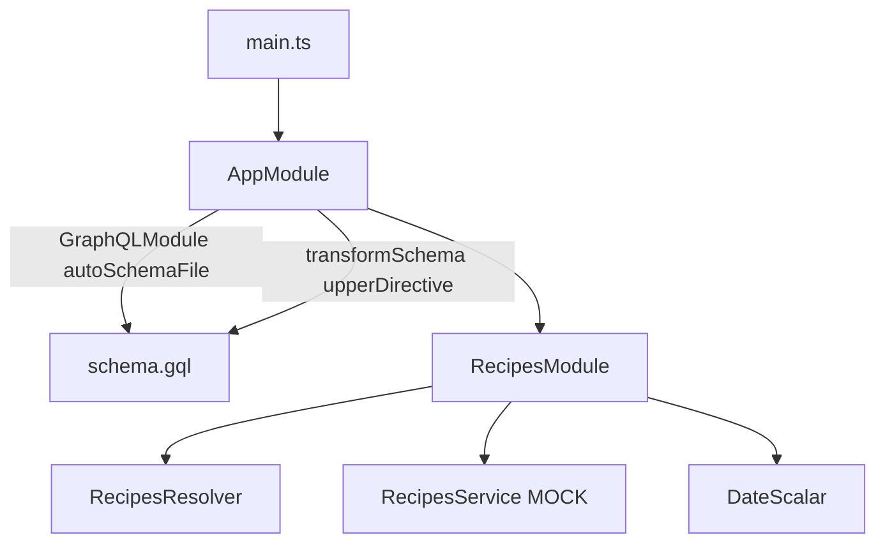

# 23-graphql-code-first — NestJS Sample

**Code-first GraphQL** with Apollo — schema auto-generated to `schema.gql`. Includes custom scalar, `@upper` directive transformer, validation on inputs, and subscription examples. **`RecipesService` is a mock.**

## Quick start

```bash
cd sample/23-graphql-code-first
npm install
npm run start:dev
```

GraphQL: **http://localhost:3000/graphql**  
Generated schema: `schema.gql` (project root)

---


<!-- CORE_INVENTORY_START -->
## Core elements inventory

> Generated from `23-graphql-code-first/src`. **Wired** = registered in a module or applied globally. **Example** = present in code but not registered.

### Application type

| Property | Value |
| -------- | ----- |
| **Bootstrap** | `NestFactory.create(AppModule)` |
| **Kind** | HTTP server |
| **Entry file** | `main.ts` |
| **Port** | 3000 |

**Stack notes:** GraphQL endpoint enabled

**Global setup (`main.ts`):** `ValidationPipe` (global, `@nestjs/common`)

### Modules (2)

| Module | Path | Imports | Controllers | Providers |
| ------ | ---- | ------- | ----------- | --------- |
| `AppModule` | `src/app.module.ts` | `RecipesModule`, `GraphQLModule`, `GraphQLDirective` | — | — |
| `RecipesModule` | `src/recipes/recipes.module.ts` | — | — | `RecipesResolver` |

### Controllers (0)

_None_

### GraphQL resolvers (1)

| Name | Path | Status |
| ---- | ---- | ------ |
| `RecipesResolver` | `src/recipes/recipes.resolver.ts` | **Wired** |

### Providers / services (1)

| Name | Path | Status |
| ---- | ---- | ------ |
| `RecipesService` | `src/recipes/recipes.service.ts` | Example (not registered) |

### Guards (0)

_None_

### Interceptors (0)

_None_

### Pipes (0)

_None_

### Exception filters (0)

_None_

### Middleware (0)

_None_

### Decorators used (21)

| Library | Decorators |
| ------- | ---------- |
| **@nestjs (@nestjs/apollo)** | `@Plugin` |
| **@nestjs (@nestjs/common)** | `@Injectable`, `@Module` |
| **@nestjs (@nestjs/graphql)** | `@Args`, `@ArgsType`, `@Directive`, `@Field`, `@InputType`, `@Mutation`, `@ObjectType`, `@Query`, `@Resolver`, `@Scalar`, `@Subscription` |
| **Unknown** | `@apollo`, `@graphql` |
| **class-validator** | `@IsOptional`, `@Length`, `@Max`, `@MaxLength`, `@Min` |

---
<!-- CORE_INVENTORY_END -->
## Project structure

```
sample/23-graphql-code-first/
├── src/
│   ├── main.ts
│   ├── app.module.ts
│   ├── recipes/
│   │   ├── recipes.module.ts
│   │   ├── recipes.resolver.ts
│   │   ├── recipes.service.ts      # MOCK implementation
│   │   ├── models/recipe.model.ts
│   │   └── dto/
│   │       ├── new-recipe.input.ts
│   │       └── recipes.args.ts
│   └── common/
│       ├── scalars/date.scalar.ts
│       ├── directives/upper-case.directive.ts
│       └── plugins/
│           ├── logging.plugin.ts       # Not wired
│           └── complexity.plugin.ts    # Not wired
└── schema.gql                          # Auto-generated
```

---

## How the app boots



---

## Module graph

| Component         | Origin   | Registered in           | Role                    |
| ----------------- | -------- | ----------------------- | ----------------------- |
| `AppModule`       | **User** | Root                    | GraphQL config          |
| `RecipesModule`   | **User** | `AppModule`             | Resolver + mock service |
| `RecipesResolver` | **User** | `RecipesModule.providers` | Queries, mutations, subs |
| `RecipesService`  | **User** | `RecipesModule.providers` | Stub data             |
| `DateScalar`      | **User** | `RecipesModule.providers` | Custom Date scalar    |

---

## Decorator glossary (`@`)

### NestJS GraphQL

| Decorator        | Used on              | Purpose                    |
| ---------------- | -------------------- | -------------------------- |
| `@Module`        | Modules              | Module declaration         |
| `@Resolver`      | `RecipesResolver`    | Resolver class             |
| `@Query`, `@Mutation`, `@Subscription` | Handlers | GraphQL operations |
| `@Args`, `@ArgsType`, `@Field`, `@ObjectType`, `@InputType` | DTOs/models | Schema definition |
| `@Directive('@upper')` | `Recipe.description` | Federation-style directive on field |
| `@Scalar('Date', () => Date)` | `DateScalar` | Custom scalar          |
| `@Plugin`        | Plugin classes       | Apollo plugins (not wired) |
| `@Injectable`    | Services, scalar     | DI marker                  |

### class-validator

| Decorator    | Used on inputs/args |
| ------------ | ------------------- |
| `@MaxLength`, `@Length`, `@Min`, `@Max`, `@IsOptional` | Validation |

**User-created:** `upperDirectiveTransformer` — plain function, not a decorator.

---

## Wired vs example-only

| Wired | Example-only |
| ----- | ------------ |
| Code-first schema, `@upper` transformer, `DateScalar` | `LoggingPlugin`, `ComplexityPlugin` |
| Resolver + mock service | Real persistence |

---

## Dependencies

`@nestjs/graphql`, `@nestjs/apollo`, `graphql`, `graphql-subscriptions`, `graphql-query-complexity`, `class-validator`
