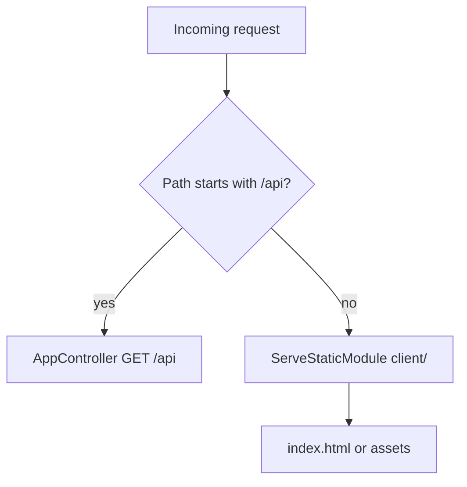

# 24-serve-static — NestJS Sample

Serves a **static SPA/client** from `client/` alongside a **prefixed REST API** at `/api`. Demonstrates `@nestjs/serve-static` with route exclusion and strict fallthrough.

## Quick start

```bash
cd sample/24-serve-static
npm install
npm run start:dev
```

- Static site: **http://localhost:3000/** → `client/index.html`
- API: **http://localhost:3000/api** → `"Hello, world!"`

---


<!-- CORE_INVENTORY_START -->
## Core elements inventory

> Generated from `24-serve-static/src`. **Wired** = registered in a module or applied globally. **Example** = present in code but not registered.

### Application type

| Property | Value |
| -------- | ----- |
| **Bootstrap** | `NestFactory.create(AppModule)` |
| **Kind** | HTTP server |
| **Entry file** | `main.ts` |
| **Port** | 3000 |

**Stack notes:** Static file serving enabled

**Global setup (`main.ts`):** Global prefix: `/api`

### Modules (1)

| Module | Path | Imports | Controllers | Providers |
| ------ | ---- | ------- | ----------- | --------- |
| `AppModule` | `src/app.module.ts` | `ServeStaticModule` | `AppController` | — |

### Controllers (1)

| Name | Path | Status |
| ---- | ---- | ------ |
| `AppController` | `src/app.controller.ts` | **Wired** |

### Providers / services (0)

_None_

### Guards (0)

_None_

### Interceptors (0)

_None_

### Pipes (0)

_None_

### Exception filters (0)

_None_

### Middleware (0)

_None_

### Decorators used (3)

| Library | Decorators |
| ------- | ---------- |
| **@nestjs (@nestjs/common)** | `@Controller`, `@Get`, `@Module` |

---
<!-- CORE_INVENTORY_END -->
## Project structure

```
sample/24-serve-static/
├── src/
│   ├── main.ts                       # setGlobalPrefix('api')
│   ├── app.module.ts
│   └── app.controller.ts
└── client/
    ├── index.html
    └── logo.svg
```

---

## How routing works



`main.ts`:

```typescript
app.setGlobalPrefix('api');
```

`ServeStaticModule` serves `client/` for non-API paths. `exclude: ['/api/{*test}']` prevents static middleware from handling API routes. `fallthrough: false` returns 404 for missing static files (no fallback to Nest handlers).

---

## Module graph

| Component       | Origin   | Role                              |
| --------------- | -------- | --------------------------------- |
| `AppModule`     | **User** | Static module + controller        |
| `AppController` | **User** | `GET /` → `"Hello, world!"` (under `/api` prefix) |

No services — flat controller-only app.

---

## Decorator glossary (`@`)

| Decorator     | Library  | Used on       | Purpose              |
| ------------- | -------- | ------------- | -------------------- |
| `@Module`     | **NestJS** | `AppModule` | Module + static import |
| `@Controller`| **NestJS** | Controller  | API controller       |
| `@Get`        | **NestJS** | Handler     | GET `/api`           |

**User-created decorators:** none.

---

## Mental model

1. **`setGlobalPrefix('api')`** namespaces Nest controllers under `/api`.
2. **`ServeStaticModule.forRoot()`** registers static file middleware for everything else.
3. **`exclude`** patterns let API routes bypass static serving.
4. Common pattern: Nest API + pre-built frontend in one deployment.

---

## Dependencies

`@nestjs/serve-static`
