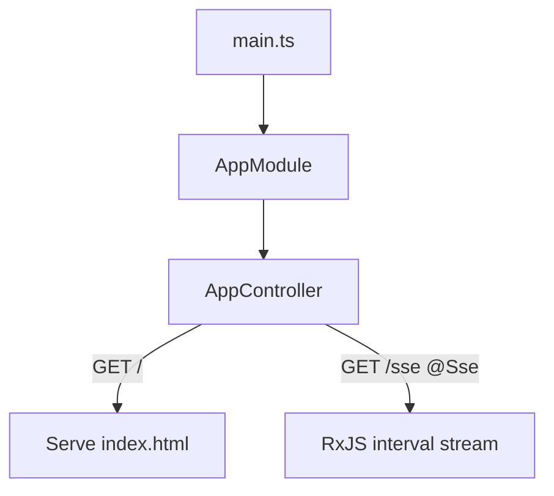

# 28-sse — NestJS Sample

**Server-Sent Events (SSE)** streaming endpoint plus a static HTML demo page served from the same controller.

## Quick start

```bash
cd sample/28-sse
npm install
npm run start:dev
```

- Demo page: **http://localhost:3000/**
- SSE stream: **http://localhost:3000/sse**

Events: `{ data: { hello: 'world' } }` every 1 second.

---


<!-- CORE_INVENTORY_START -->
## Core elements inventory

> Generated from `28-sse/src`. **Wired** = registered in a module or applied globally. **Example** = present in code but not registered.

### Application type

| Property | Value |
| -------- | ----- |
| **Bootstrap** | `NestFactory.create(AppModule)` |
| **Kind** | HTTP server |
| **Entry file** | `main.ts` |
| **Port** | 3000 |

**Global setup (`main.ts`):** Shutdown hooks enabled

### Modules (1)

| Module | Path | Imports | Controllers | Providers |
| ------ | ---- | ------- | ----------- | --------- |
| `AppModule` | `src/app.module.ts` | — | `AppController` | — |

### Controllers (1)

| Name | Path | Status |
| ---- | ---- | ------ |
| `AppController` | `src/app.controller.ts` | **Wired** |

### Providers / services (0)

_None_

### Guards (0)

_None_

### Interceptors (0)

_None_

### Pipes (0)

_None_

### Exception filters (0)

_None_

### Middleware (0)

_None_

### Decorators used (5)

| Library | Decorators |
| ------- | ---------- |
| **@nestjs (@nestjs/common)** | `@Controller`, `@Get`, `@Module`, `@Res`, `@Sse` |

---
<!-- CORE_INVENTORY_END -->
## Project structure

```
sample/28-sse/
├── src/
│   ├── main.ts                       # enableShutdownHooks, forceCloseConnections
│   ├── app.module.ts
│   ├── app.controller.ts
│   └── index.html                    # Client demo (EventSource)
```

---

## How the app boots



Shutdown hooks ensure SSE connections close gracefully on app termination.

---

## Controller methods

| Method   | Decorators        | Role                              |
| -------- | ----------------- | --------------------------------- |
| `index()`| `@Get()`, `@Res()`| Sends `index.html` file           |
| `sse()`  | `@Sse('sse')`     | Returns `Observable` of MessageEvent |

```typescript
@Sse('sse')
sse(): Observable<MessageEvent> {
  return interval(1000).pipe(map((_) => ({ data: { hello: 'world' } })));
}
```

---

## Decorator glossary (`@`)

| Decorator   | Library  | Used on    | Purpose                    |
| ----------- | -------- | ---------- | -------------------------- |
| `@Module`   | **NestJS** | Module   | Module declaration         |
| `@Controller` | **NestJS** | Controller | HTTP controller        |
| `@Get`      | **NestJS** | Handlers   | HTTP GET routes            |
| `@Res`      | **NestJS** | `index`    | Raw Express/Fastify response |
| `@Sse('sse')` | **NestJS** | `sse`    | SSE endpoint               |

**User-created decorators:** none.

---

## Dependencies

`rxjs`

---

## Mental model

**SSE** is one-way server → client streaming over HTTP. Nest's `@Sse()` returns an RxJS `Observable` that emits `MessageEvent` objects.
