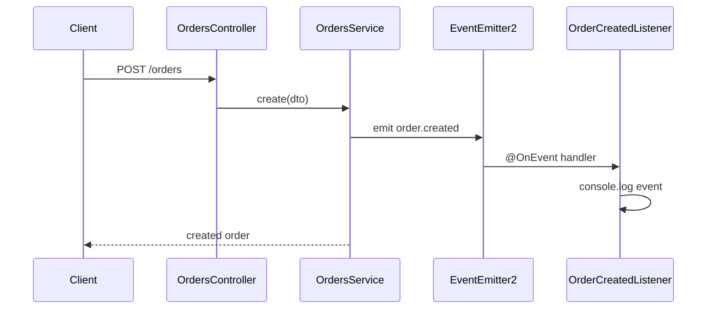
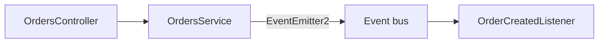

# 30-event-emitter — NestJS Sample

**In-process events** with `@nestjs/event-emitter`. Creating an order emits `order.created`; a listener reacts asynchronously.

## Quick start

```bash
cd sample/30-event-emitter
npm install
npm run start:dev
```

App listens on **http://localhost:3000**.

| Method | Path      | Description                          |
| ------ | --------- | ------------------------------------ |
| `POST` | `/orders` | Create order → emits `order.created` |

Listener logs the event to the console.

---


<!-- CORE_INVENTORY_START -->
## Core elements inventory

> Generated from `30-event-emitter/src`. **Wired** = registered in a module or applied globally. **Example** = present in code but not registered.

### Application type

| Property | Value |
| -------- | ----- |
| **Bootstrap** | `NestFactory.create(AppModule)` |
| **Kind** | HTTP server |
| **Entry file** | `main.ts` |
| **Port** | 3000 |

**Stack notes:** Event emitter enabled

### Modules (2)

| Module | Path | Imports | Controllers | Providers |
| ------ | ---- | ------- | ----------- | --------- |
| `AppModule` | `src/app.module.ts` | `EventEmitterModule`, `OrdersModule` | — | — |
| `OrdersModule` | `src/orders/orders.module.ts` | — | `OrdersController` | `OrdersService` |

### Controllers (1)

| Name | Path | Status |
| ---- | ---- | ------ |
| `OrdersController` | `src/orders/orders.controller.ts` | **Wired** |

### Providers / services (2)

| Name | Path | Status |
| ---- | ---- | ------ |
| `OrderCreatedListener` | `src/orders/listeners/order-created.listener.ts` | Example (not registered) |
| `OrdersService` | `src/orders/orders.service.ts` | **Wired** |

### Guards (0)

_None_

### Interceptors (0)

_None_

### Pipes (0)

_None_

### Exception filters (0)

_None_

### Middleware (0)

_None_

### Decorators used (6)

| Library | Decorators |
| ------- | ---------- |
| **@nestjs (@nestjs/common)** | `@Body`, `@Controller`, `@Injectable`, `@Module`, `@Post` |
| **@nestjs (@nestjs/event-emitter)** | `@OnEvent` |

---
<!-- CORE_INVENTORY_END -->
## Project structure

```
sample/30-event-emitter/
├── src/
│   ├── main.ts
│   ├── app.module.ts
│   └── orders/
│       ├── orders.module.ts
│       ├── orders.controller.ts
│       ├── orders.service.ts
│       ├── dto/create-order.dto.ts
│       ├── entities/order.entity.ts
│       ├── events/order-created.event.ts
│       └── listeners/order-created.listener.ts
```

---

## Event flow



---

## Module graph

| Component              | Origin   | Role                              |
| ---------------------- | -------- | --------------------------------- |
| `AppModule`            | **User** | `EventEmitterModule.forRoot()`    |
| `OrdersModule`         | **User** | Controller, service, listener     |
| `OrdersController`     | **User** | `POST /orders`                    |
| `OrdersService`        | **User** | In-memory store + `emit()`        |
| `OrderCreatedListener` | **User** | `@OnEvent('order.created')`       |



---

## Decorator glossary (`@`)

| Decorator              | Library  | Used on              | Purpose                    |
| ---------------------- | -------- | -------------------- | -------------------------- |
| `@Module`              | **NestJS** | Modules            | Module declaration         |
| `@Controller`          | **NestJS** | Controller         | HTTP routes                |
| `@Post`, `@Body`       | **NestJS** | Handler            | Create order               |
| `@Injectable`          | **NestJS** | Service, listener  | DI marker                  |
| `@OnEvent('order.created')` | **NestJS** + **@nestjs/event-emitter** | Listener method | Event handler |

**User-created decorators:** none. DTO/entity classes are plain TypeScript.

---

## Mental model

1. **`EventEmitterModule.forRoot()`** registers a global event bus.
2. Services **`emit()`** events by name (or use event class instances).
3. Listeners use **`@OnEvent()`** — decouples side effects from the main flow.

---

## Dependencies

`@nestjs/event-emitter`
