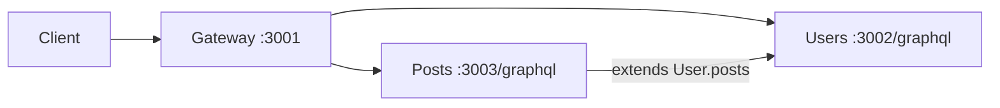

# 31-graphql-federation-code-first — NestJS Sample

**Apollo GraphQL Federation v2** with **code-first** schema generation across **three separate Nest applications**: a gateway and two subgraphs (users, posts).

## Architecture

```
31-graphql-federation-code-first/
├── gateway/                 → :3001  Apollo Gateway (composes subgraphs)
├── users-application/       → :3002  User subgraph
└── posts-application/       → :3003  Post subgraph (+ extends User)
```



## Quick start

Start **subgraphs first**, then the gateway:

```bash
# Terminal 1 — users
cd sample/31-graphql-federation-code-first/users-application
npm install && npm run start:dev

# Terminal 2 — posts
cd sample/31-graphql-federation-code-first/posts-application
npm install && npm run start:dev

# Terminal 3 — gateway
cd sample/31-graphql-federation-code-first/gateway
npm install && npm run start:dev
```

Federated GraphQL: **http://localhost:3001/graphql**

Example query:

```graphql
query {
  getUser(id: 1) {
    id
    name
    posts { title }
  }
}
```

---


<!-- CORE_INVENTORY_START -->
## Core elements inventory

> Generated from `31-graphql-federation-code-first/src`. **Wired** = registered in a module or applied globally. **Example** = present in code but not registered.

### Application type

| Property | Value |
| -------- | ----- |
| **Bootstrap** | `N/A` |
| **Kind** | Unknown |
| **Entry file** | `N/A` |

### Modules (5)

| Module | Path | Imports | Controllers | Providers |
| ------ | ---- | ------- | ----------- | --------- |
| `AppModule` | `gateway/src/app.module.ts` | `GraphQLModule` | — | — |
| `AppModule` | `posts-application/src/app.module.ts` | `PostsModule` | — | — |
| `AppModule` | `users-application/src/app.module.ts` | `UsersModule` | — | — |
| `PostsModule` | `posts-application/src/posts/posts.module.ts` | `GraphQLModule` | — | `PostsService` |
| `UsersModule` | `users-application/src/users/users.module.ts` | `GraphQLModule` | — | `UsersResolver` |

### Controllers (0)

_None_

### GraphQL resolvers (3)

| Name | Path | Status |
| ---- | ---- | ------ |
| `PostsResolver` | `posts-application/src/posts/posts.resolver.ts` | Example (not registered) |
| `UsersResolver` | `posts-application/src/posts/users.resolver.ts` | **Wired** |
| `UsersResolver` | `users-application/src/users/users.resolver.ts` | **Wired** |

### Providers / services (2)

| Name | Path | Status |
| ---- | ---- | ------ |
| `PostsService` | `posts-application/src/posts/posts.service.ts` | **Wired** |
| `UsersService` | `users-application/src/users/users.service.ts` | Example (not registered) |

### Guards (0)

_None_

### Interceptors (0)

_None_

### Pipes (0)

_None_

### Exception filters (0)

_None_

### Middleware (0)

_None_

### Decorators used (12)

| Library | Decorators |
| ------- | ---------- |
| **@nestjs (@nestjs/common)** | `@Injectable`, `@Module` |
| **@nestjs (@nestjs/graphql)** | `@Args`, `@Directive`, `@Field`, `@ObjectType`, `@Parent`, `@Query`, `@ResolveField`, `@ResolveReference`, `@Resolver` |
| **Unknown** | `@apollo` |

---
<!-- CORE_INVENTORY_END -->
## Sub-applications

| App | Port | README |
| --- | ---- | ------ |
| Gateway | 3001 | [gateway/README.md](./gateway/README.md) |
| Users subgraph | 3002 | [users-application/README.md](./users-application/README.md) |
| Posts subgraph | 3003 | [posts-application/README.md](./posts-application/README.md) |

---

## Federation concepts demonstrated

| Concept | Where |
| ------- | ----- |
| `@key` entity | `User`, `Post` models |
| `@ResolveReference()` | `UsersResolver`, `PostsResolver` |
| `@extends` / `@external` | `User` stub in posts app |
| `@ResolveField` | `User.posts` in posts app |
| Code-first `autoSchemaFile: { federation: 2 }` | Each subgraph |

---

## Decorators (cross-cutting)

### NestJS GraphQL

`@Module`, `@Resolver`, `@Query`, `@ResolveReference`, `@ResolveField`, `@Parent`, `@Args`, `@ObjectType`, `@Field`, `@Injectable`

### Apollo Federation (via `@Directive`)

| Directive   | Library              | Purpose              |
| ----------- | -------------------- | -------------------- |
| `@key`      | **Apollo Federation**| Entity primary key   |
| `@extends`  | **Apollo Federation**| Extend remote type   |
| `@external` | **Apollo Federation**| Field owned elsewhere|

**User-created decorators:** none.

---

## Dependencies

`@apollo/gateway`, `@nestjs/apollo`, `@nestjs/graphql`, `graphql`, `@apollo/server`

---

## Mental model

1. Each **subgraph** owns part of the schema and runs independently.
2. The **gateway** introspects subgraphs and routes federated queries.
3. **`@ResolveReference`** loads entities by key when another subgraph references them.
4. **Posts app extends User** with a `posts` field without owning the full User type.
