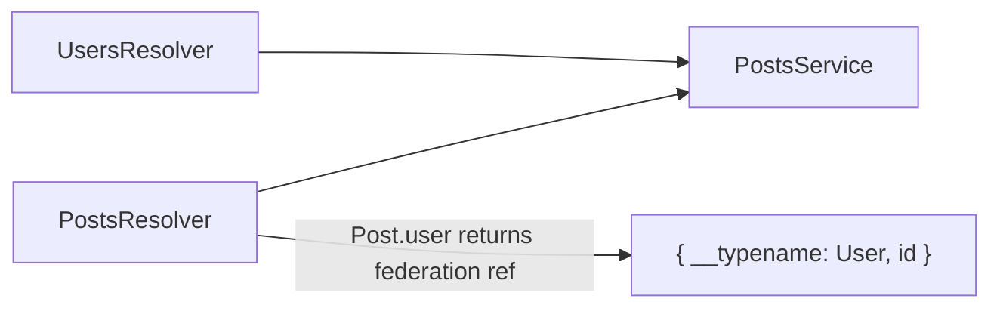

# Posts Application — Federation Sample 31

**Posts subgraph** — owns `Post` and **extends** `User` with a `posts` field.

## Quick start

```bash
cd sample/31-graphql-federation-code-first/posts-application
npm install
npm run start:dev
```

GraphQL: **http://localhost:3003/graphql**

---


<!-- CORE_INVENTORY_START -->
## Core elements inventory

> Generated from `posts-application/src`. **Wired** = registered in a module or applied globally. **Example** = present in code but not registered.

### Application type

| Property | Value |
| -------- | ----- |
| **Bootstrap** | `NestFactory.create(AppModule)` |
| **Kind** | HTTP server |
| **Entry file** | `main.ts` |
| **Port** | 3003 |

**Stack notes:** GraphQL endpoint enabled

### Modules (2)

| Module | Path | Imports | Controllers | Providers |
| ------ | ---- | ------- | ----------- | --------- |
| `AppModule` | `src/app.module.ts` | `PostsModule` | — | — |
| `PostsModule` | `src/posts/posts.module.ts` | `GraphQLModule` | — | `PostsService` |

### Controllers (0)

_None_

### GraphQL resolvers (2)

| Name | Path | Status |
| ---- | ---- | ------ |
| `PostsResolver` | `src/posts/posts.resolver.ts` | Example (not registered) |
| `UsersResolver` | `src/posts/users.resolver.ts` | Example (not registered) |

### Providers / services (1)

| Name | Path | Status |
| ---- | ---- | ------ |
| `PostsService` | `src/posts/posts.service.ts` | **Wired** |

### Guards (0)

_None_

### Interceptors (0)

_None_

### Pipes (0)

_None_

### Exception filters (0)

_None_

### Middleware (0)

_None_

### Decorators used (11)

| Library | Decorators |
| ------- | ---------- |
| **@nestjs (@nestjs/common)** | `@Injectable`, `@Module` |
| **@nestjs (@nestjs/graphql)** | `@Args`, `@Directive`, `@Field`, `@ObjectType`, `@Parent`, `@Query`, `@ResolveField`, `@Resolver` |
| **Unknown** | `@apollo` |

---
<!-- CORE_INVENTORY_END -->
## Project structure

```
posts-application/
└── src/
    ├── main.ts
    ├── app.module.ts
    └── posts/
        ├── posts.module.ts
        ├── posts.resolver.ts
        ├── users.resolver.ts       # Extends User with posts field
        ├── posts.service.ts
        └── models/
            ├── post.model.ts
            └── user.model.ts       # @extends User stub
```

---

## Module graph

| Component       | Origin   | Role                              |
| --------------- | -------- | --------------------------------- |
| `PostsModule`   | **User** | Federation driver + resolvers     |
| `PostsResolver` | **User** | Post queries + reference resolution |
| `UsersResolver` | **User** | `@ResolveField` for `User.posts`  |
| `PostsService`  | **User** | In-memory posts                   |



---

## Federation relations

| Type   | Directives                         | Owned by   |
| ------ | ---------------------------------- | ---------- |
| `Post` | `@key(fields: "id")`               | Posts app  |
| `User` | `@extends @key`, `@external id`    | Users app (stub here) |

`UsersResolver.getPosts()` resolves `User.posts` by filtering posts where `authorId === user.id`.

---

## Decorator glossary (`@`)

| Decorator              | Library  | Used on              |
| ---------------------- | -------- | -------------------- |
| `@Module`              | **NestJS** | Modules            |
| `@Resolver`            | **NestJS** | Resolvers          |
| `@Query`, `@ResolveField`, `@ResolveReference`, `@Parent`, `@Args` | **NestJS** | Handlers |
| `@ObjectType`, `@Field`| **NestJS** | Models             |
| `@Directive('@key')`, `@Directive('@extends')`, `@Directive('@external')` | **Apollo Federation** | Models |
| `@Injectable`          | **NestJS** | `PostsService`     |

**User-created decorators:** none.

---

## Dependencies

`@nestjs/graphql`, `@nestjs/apollo`, `@apollo/server`
