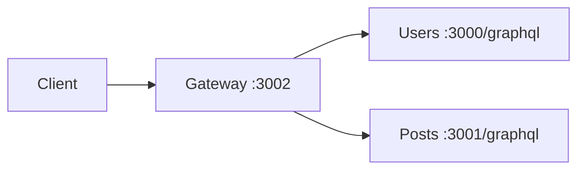

# 32-graphql-federation-schema-first — NestJS Sample

**Apollo GraphQL Federation v2** with **schema-first** approach (`.graphql` SDL files) across three Nest applications.

## Architecture

```
32-graphql-federation-schema-first/
├── gateway/                 → :3002  Apollo Gateway
├── users-application/       → :3000  User subgraph
└── posts-application/       → :3001  Post subgraph
```



## Quick start

Start subgraphs first, then gateway:

```bash
# Users — :3000
cd sample/32-graphql-federation-schema-first/users-application
npm install && npm run start:dev

# Posts — :3001
cd sample/32-graphql-federation-schema-first/posts-application
npm install && npm run start:dev

# Gateway — :3002
cd sample/32-graphql-federation-schema-first/gateway
npm install && npm run start:dev
```

Federated GraphQL: **http://localhost:3002/graphql**

---


<!-- CORE_INVENTORY_START -->
## Core elements inventory

> Generated from `32-graphql-federation-schema-first/src`. **Wired** = registered in a module or applied globally. **Example** = present in code but not registered.

### Application type

| Property | Value |
| -------- | ----- |
| **Bootstrap** | `N/A` |
| **Kind** | Unknown |
| **Entry file** | `N/A` |

### Modules (5)

| Module | Path | Imports | Controllers | Providers |
| ------ | ---- | ------- | ----------- | --------- |
| `AppModule` | `gateway/src/app.module.ts` | `GraphQLModule` | — | — |
| `AppModule` | `posts-application/src/app.module.ts` | `PostsModule` | — | — |
| `AppModule` | `users-application/src/app.module.ts` | `UsersModule` | — | — |
| `PostsModule` | `posts-application/src/posts/posts.module.ts` | `GraphQLModule` | — | `PostsService` |
| `UsersModule` | `users-application/src/users/users.module.ts` | `GraphQLModule` | — | `UsersResolver` |

### Controllers (0)

_None_

### GraphQL resolvers (3)

| Name | Path | Status |
| ---- | ---- | ------ |
| `PostsResolver` | `posts-application/src/posts/posts.resolver.ts` | Example (not registered) |
| `UsersResolver` | `posts-application/src/posts/users.resolver.ts` | **Wired** |
| `UsersResolver` | `users-application/src/users/users.resolver.ts` | **Wired** |

### Providers / services (2)

| Name | Path | Status |
| ---- | ---- | ------ |
| `PostsService` | `posts-application/src/posts/posts.service.ts` | **Wired** |
| `UsersService` | `users-application/src/users/users.service.ts` | Example (not registered) |

### Guards (0)

_None_

### Interceptors (0)

_None_

### Pipes (0)

_None_

### Exception filters (0)

_None_

### Middleware (0)

_None_

### Decorators used (12)

| Library | Decorators |
| ------- | ---------- |
| **@nestjs (@nestjs/common)** | `@Injectable`, `@Module` |
| **@nestjs (@nestjs/graphql)** | `@Args`, `@Directive`, `@Field`, `@ObjectType`, `@Parent`, `@Query`, `@ResolveField`, `@ResolveReference`, `@Resolver` |
| **Unknown** | `@apollo` |

---
<!-- CORE_INVENTORY_END -->
## Sub-applications

| App | Port | README |
| --- | ---- | ------ |
| Gateway | 3002 | [gateway/README.md](./gateway/README.md) |
| Users | 3000 | [users-application/README.md](./users-application/README.md) |
| Posts | 3001 | [posts-application/README.md](./posts-application/README.md) |

---

## vs sample 31 (code-first)

| Aspect        | 31 code-first              | 32 schema-first            |
| ------------- | -------------------------- | -------------------------- |
| Schema source | `@ObjectType` decorators   | `*.graphql` SDL files      |
| Resolver binding | `@Query()` type inferred | `@Query('getUser')` string names |
| Gateway port  | 3001                       | 3002                       |

---

## Key SDL files

**users/users.graphql:** `User @key(fields: "id")`, `getUser(id: ID!): User`

**posts/posts.graphql:** `Post @key`, extended `User` with `posts`, `getPosts`, `findPost`

---

## Decorator glossary (shared)

### NestJS GraphQL (schema-first)

`@Resolver('User')`, `@Query('getUser')`, `@ResolveField`, `@ResolveReference`, `@Module`, `@Injectable`

### Apollo Federation on models

`@Directive('@key')`, `@Directive('@extends')`, `@Directive('@external')`

**User-created decorators:** none.

---

## Dependencies

`@apollo/gateway`, `@nestjs/graphql`, `@nestjs/apollo`, `graphql`
