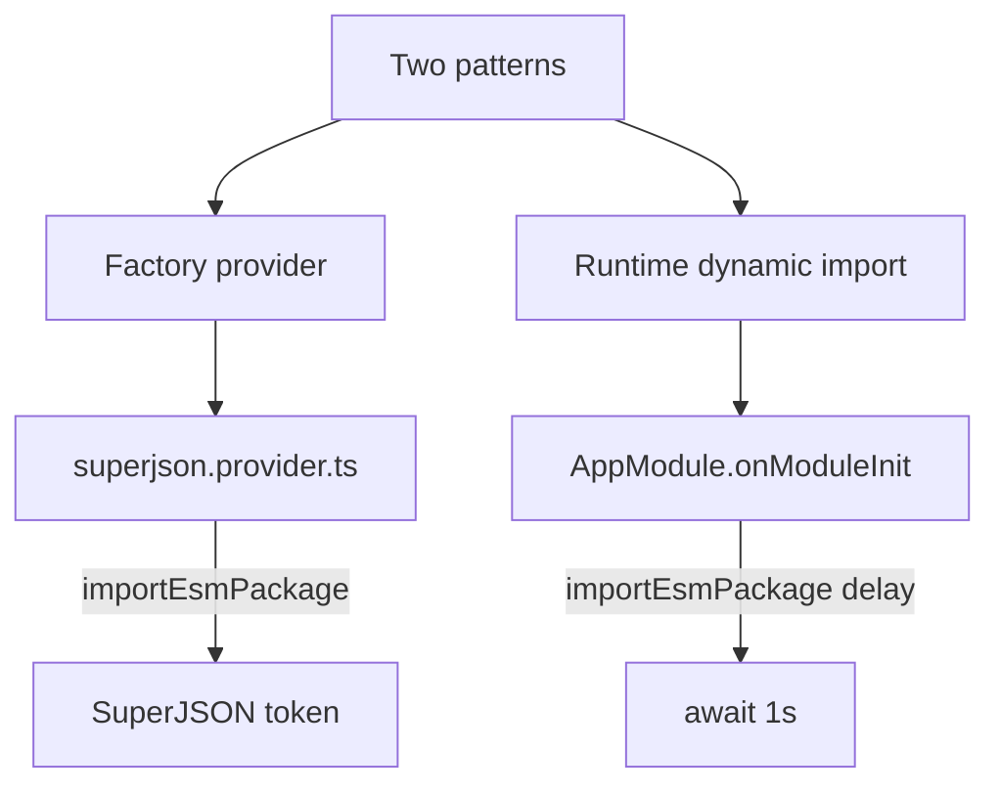

# 34-using-esm-packages — NestJS Sample

Load **ESM-only npm packages** (`superjson`, `delay`) from a **CommonJS** Nest app (Node 18+) using dynamic import workarounds that prevent TypeScript from transpiling `import()` to `require()`.

## Quick start

```bash
cd sample/34-using-esm-packages
npm install
npm run start:dev
```

App listens on **http://localhost:3000**.

| Method | Path | Description                          |
| ------ | ---- | ------------------------------------ |
| `GET`  | `/`  | Uses `SuperJSON` injected via factory |

On bootstrap, `AppModule.onModuleInit` dynamically imports `delay` and waits 1 second (console demo).

---


<!-- CORE_INVENTORY_START -->
## Core elements inventory

> Generated from `34-using-esm-packages/src`. **Wired** = registered in a module or applied globally. **Example** = present in code but not registered.

### Application type

| Property | Value |
| -------- | ----- |
| **Bootstrap** | `NestFactory.create(AppModule)` |
| **Kind** | HTTP server |
| **Entry file** | `main.ts` |
| **Port** | 3000 |

### Modules (1)

| Module | Path | Imports | Controllers | Providers |
| ------ | ---- | ------- | ----------- | --------- |
| `AppModule` | `src/app.module.ts` | — | `AppController` | `AppService` |

### Controllers (1)

| Name | Path | Status |
| ---- | ---- | ------ |
| `AppController` | `src/app.controller.ts` | **Wired** |

### Providers / services (1)

| Name | Path | Status |
| ---- | ---- | ------ |
| `AppService` | `src/app.service.ts` | **Wired** |

### Guards (0)

_None_

### Interceptors (0)

_None_

### Pipes (0)

_None_

### Exception filters (0)

_None_

### Middleware (0)

_None_

### Decorators used (5)

| Library | Decorators |
| ------- | ---------- |
| **@nestjs (@nestjs/common)** | `@Controller`, `@Get`, `@Inject`, `@Injectable`, `@Module` |

---
<!-- CORE_INVENTORY_END -->
## Project structure

```
sample/34-using-esm-packages/
├── src/
│   ├── main.ts
│   ├── app.module.ts                 # OnModuleInit + delay import
│   ├── app.controller.ts
│   ├── app.service.ts
│   ├── superjson.provider.ts         # Factory provider pattern
│   └── import-esm-package.ts         # Dynamic import helper
```

`package.json`: `"type": "commonjs"`

---

## ESM loading patterns



**Helper** (`import-esm-package.ts`):

```typescript
export const importEsmPackage = async (packageName: string) =>
  new Function(`return import('${packageName}')`)().then(
    m => m['default'] ?? m,
  );
```

Uses `new Function` so TS does not rewrite to `require()`.

---

## Module graph

| Component            | Origin   | Role                              |
| -------------------- | -------- | --------------------------------- |
| `superJSONProvider`  | **User** | Async factory → `'SuperJSON'` token |
| `AppService`         | **User** | `@Inject('SuperJSON')`            |
| `AppModule`          | **User** | Implements `OnModuleInit`         |

---

## Decorator glossary (`@`)

| Decorator              | Library  | Used on              |
| ---------------------- | -------- | -------------------- |
| `@Module`              | **NestJS** | `AppModule`        |
| `@Controller`, `@Get`  | **NestJS** | Controller         |
| `@Injectable`          | **NestJS** | `AppService`       |
| `@Inject('SuperJSON')` | **NestJS** | `AppService`       |

**User-created:** `importEsmPackage` helper and `superJSONProvider` factory (not decorators).

---

## vs sample 35

Sample **35** uses Node 22+ `--experimental-require-module` for simpler direct ESM imports. This sample shows the **pre-Node 22 workaround**.

---

## Dependencies

`superjson` (ESM), `delay` (ESM)

Jest: `NODE_OPTIONS=--experimental-vm-modules`
