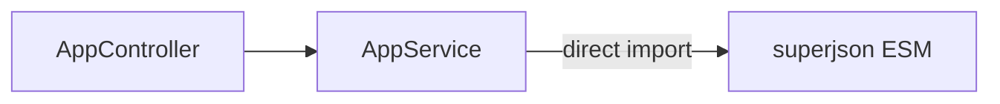

# 35-use-esm-package-after-node22 — NestJS Sample

**Direct ESM import** of `superjson` in a CommonJS Nest project using Node **22+** and `--experimental-require-module` — simpler than sample 34's dynamic import workaround.

## Quick start

Requires **Node >= 22**.

```bash
cd sample/35-use-esm-package-after-node22
npm install
npm run start:dev    # uses --experimental-require-module
```

App listens on **http://localhost:3000**.

| Method | Path | Description                    |
| ------ | ---- | ------------------------------ |
| `GET`  | `/`  | Serializes data with superjson |

---


<!-- CORE_INVENTORY_START -->
## Core elements inventory

> Generated from `35-use-esm-package-after-node22/src`. **Wired** = registered in a module or applied globally. **Example** = present in code but not registered.

### Application type

| Property | Value |
| -------- | ----- |
| **Bootstrap** | `NestFactory.create(AppModule)` |
| **Kind** | HTTP server |
| **Entry file** | `main.ts` |
| **Port** | 3000 |

### Modules (1)

| Module | Path | Imports | Controllers | Providers |
| ------ | ---- | ------- | ----------- | --------- |
| `AppModule` | `src/app.module.ts` | — | `AppController` | `AppService` |

### Controllers (1)

| Name | Path | Status |
| ---- | ---- | ------ |
| `AppController` | `src/app.controller.ts` | **Wired** |

### Providers / services (1)

| Name | Path | Status |
| ---- | ---- | ------ |
| `AppService` | `src/app.service.ts` | **Wired** |

### Guards (0)

_None_

### Interceptors (0)

_None_

### Pipes (0)

_None_

### Exception filters (0)

_None_

### Middleware (0)

_None_

### Decorators used (4)

| Library | Decorators |
| ------- | ---------- |
| **@nestjs (@nestjs/common)** | `@Controller`, `@Get`, `@Injectable`, `@Module` |

---
<!-- CORE_INVENTORY_END -->
## Project structure

```
sample/35-use-esm-package-after-node22/
├── src/
│   ├── main.ts
│   ├── app.module.ts
│   ├── app.controller.ts
│   └── app.service.ts                # import superjson from 'superjson'
```

---

## How it works



```typescript
// app.service.ts
import superjson from 'superjson';
```

All npm scripts pass Node flag:

```json
"start:dev": "nest start --watch --exec \"node --experimental-require-module\""
```

---

## Module graph

| Component       | Origin   | Role                    |
| --------------- | -------- | ----------------------- |
| `AppController` | **User** | GET `/`                 |
| `AppService`    | **User** | Uses superjson directly |

No custom providers — ESM package imported at top of service file.

---

## Decorator glossary (`@`)

| Decorator     | Library  | Used on      |
| ------------- | -------- | ------------ |
| `@Module`     | **NestJS** | `AppModule`|
| `@Controller`, `@Get` | **NestJS** | Controller |
| `@Injectable` | **NestJS** | `AppService` |

**User-created decorators:** none.

---

## vs sample 34

| Aspect       | 34 using-esm-packages        | 35 (this sample)              |
| ------------ | ---------------------------- | ----------------------------- |
| Node         | >= 18.8                      | >= 22                         |
| ESM loading  | `importEsmPackage` + factory | Direct `import`               |
| Node flag    | Jest only                    | All start scripts             |

---

## Dependencies

`superjson`
