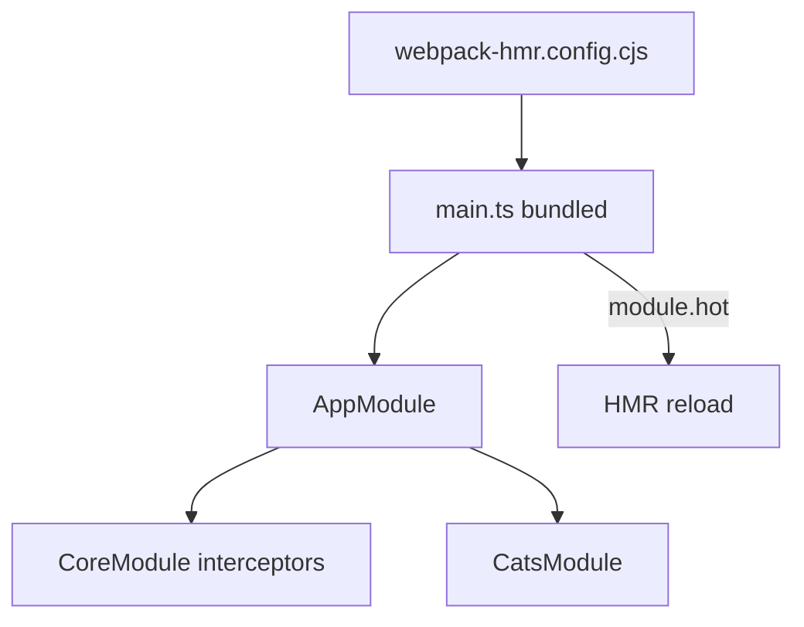

# 36-hmr-esm — NestJS Sample

**Webpack Hot Module Replacement** with an **ESM-oriented** project layout (`"type": "module"`), plus the same cats-app patterns as `01-cats-app` (guards, interceptors, pipes).

## Quick start

```bash
cd sample/36-hmr-esm
npm install
npm run start:dev    # webpack HMR watch
```

App listens on **http://localhost:3000** (or `PORT` env var).

| Method | Path        | Description                              |
| ------ | ----------- | ---------------------------------------- |
| `GET`  | `/cats`     | List cats (`{ data: [...] }` interceptor)|
| `POST` | `/cats`     | Create cat (`@Roles(['admin'])`)         |
| `GET`  | `/cats/:id` | Stub; custom `ParseIntPipe` on `:id`     |

---


<!-- CORE_INVENTORY_START -->
## Core elements inventory

> Generated from `36-hmr-esm/src`. **Wired** = registered in a module or applied globally. **Example** = present in code but not registered.

### Application type

| Property | Value |
| -------- | ----- |
| **Bootstrap** | `NestFactory.create(AppModule)` |
| **Kind** | HTTP server |
| **Entry file** | `main.ts` |
| **Port** | 3000 |

**Global setup (`main.ts`):** `ValidationPipe` (global, `@nestjs/common`)

### Modules (3)

| Module | Path | Imports | Controllers | Providers |
| ------ | ---- | ------- | ----------- | --------- |
| `AppModule` | `src/app.module.ts` | `CoreModule`, `CatsModule` | — | — |
| `CatsModule` | `src/cats/cats.module.ts` | — | `CatsController` | `CatsService` |
| `CoreModule` | `src/core/core.module.ts` | — | — | `TransformInterceptor`, `LoggingInterceptor` |

### Controllers (1)

| Name | Path | Status |
| ---- | ---- | ------ |
| `CatsController` | `src/cats/cats.controller.ts` | **Wired** |

### Providers / services (1)

| Name | Path | Status |
| ---- | ---- | ------ |
| `CatsService` | `src/cats/cats.service.ts` | **Wired** |

### Guards (1)

| Name | Path | Status |
| ---- | ---- | ------ |
| `RolesGuard` | `src/common/guards/roles.guard.ts` | **Wired** |

### Interceptors (4)

| Name | Path | Status |
| ---- | ---- | ------ |
| `ErrorsInterceptor` | `src/common/interceptors/exception.interceptor.ts` | Example (not registered) |
| `LoggingInterceptor` | `src/core/interceptors/logging.interceptor.ts` | **Wired** |
| `TimeoutInterceptor` | `src/common/interceptors/timeout.interceptor.ts` | Example (not registered) |
| `TransformInterceptor` | `src/core/interceptors/transform.interceptor.ts` | **Wired** |

### Pipes (2)

| Name | Path | Status |
| ---- | ---- | ------ |
| `ParseIntPipe` | `src/common/pipes/parse-int.pipe.ts` | **Wired** |
| `ValidationPipe` | `src/common/pipes/validation.pipe.ts` | Example (not registered) |

### Exception filters (1)

| Name | Path | Status |
| ---- | ---- | ------ |
| `HttpExceptionFilter` | `src/common/filters/http-exception.filter.ts` | Example (not registered) |

### Middleware (1)

| Name | Path | Status |
| ---- | ---- | ------ |
| `LoggerMiddleware` | `src/common/middleware/logger.middleware.ts` | Example (not registered) |

### Decorators used (12)

| Library | Decorators |
| ------- | ---------- |
| **@nestjs (@nestjs/common)** | `@Body`, `@Catch`, `@Controller`, `@Get`, `@Injectable`, `@Module`, `@Param`, `@Post`, `@UseGuards` |
| **User-created** | `@Roles` |
| **class-validator** | `@IsInt`, `@IsString` |

---
<!-- CORE_INVENTORY_END -->
## Project structure

```
sample/36-hmr-esm/
├── src/
│   ├── main.ts                       # HMR + global ValidationPipe
│   ├── app.module.ts
│   ├── cats/                         # Same layout as 01-cats-app
│   ├── core/                         # Global interceptors (active)
│   └── common/                       # Guards, pipes, etc. (mixed)
├── webpack-hmr.config.cjs
└── package.json                      # "type": "module"
```

Compare with **`01-cats-app`** (same architecture) and **`08-webpack`** (HMR only, no cats feature).

---

## How the app boots



HMR in `main.ts`:

```typescript
if (module.hot) {
  module.hot.accept();
  module.hot.dispose(() => app.close());
}
```

---

## Module graph

Same as `01-cats-app`:

| Component              | Origin   | Active? | Role                         |
| ---------------------- | -------- | ------- | ---------------------------- |
| `CoreModule`           | **User** | Yes     | `TransformInterceptor`, `LoggingInterceptor` |
| `CatsModule`           | **User** | Yes     | Controller + service         |
| `RolesGuard` + `Roles` | **User** | Yes     | Authorization metadata       |
| `ParseIntPipe`         | **User** | Yes     | Route param validation       |
| `LoggerMiddleware`, filters, extra interceptors | **User** | No | Reference code |

---

## Decorator glossary (`@`)

### NestJS

`@Module`, `@Controller`, `@Get`, `@Post`, `@Body`, `@Param`, `@UseGuards`, `@Injectable`, `@Catch`, `APP_INTERCEPTOR`

### class-validator

`@IsString`, `@IsInt` on `CreateCatDto`

### User-created

| Symbol           | File                              | Purpose                          |
| ---------------- | --------------------------------- | -------------------------------- |
| `Roles`          | `common/decorators/roles.decorator.ts` | `Reflector.createDecorator<string[]>()` |
| Custom pipes     | `common/pipes/`                   | `ParseIntPipe`, example `ValidationPipe` |

---

## Webpack / ESM config

| Setting | Value |
| ------- | ----- |
| `package.json` `"type"` | `"module"` |
| Webpack config | `webpack-hmr.config.cjs` (CJS config for ESM project) |
| Output | `main.cjs` via webpack |
| Dev script | `nest build --webpack --webpackPath webpack-hmr.config.cjs --watch` |

---

## Dependencies

`webpack`, `run-script-webpack-plugin`, `webpack-node-externals`, `class-validator`, `class-transformer`

---

## Mental model

Combines **HMR dev workflow** (sample 08) with **full Nest patterns** (sample 01) in an **ESM package** context.
